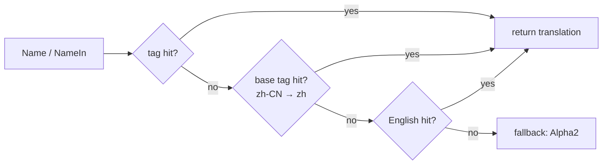

# country

The `country` package ships **ISO 3166-1 country/territory static data**: alpha-2/3/numeric codes, multi-language names (common + official), primary IANA time zones, ITU-T calling codes, the main ISO 4217 currency, UN M.49 region/sub-region, and flag emoji. All data is hardcoded in the source; after package init the indexes are read-only and lookups are zero-alloc.

It exposes a **two-shape API**: lookup by code/name (`country.Get("CN")`) or strongly-typed constants (`country.China`). Both return the same pointer.

## When to reach for it

- Accept user input as alpha-2 / alpha-3 / numeric / a country name in any language and resolve to a single `*Country`.
- Render dropdowns, region pickers, or form fields by combining `List()` + `Name()` with `language.Set` to localize on the fly.
- Look up a country from a phone calling code, or derive a sane default time zone / currency from a country.
- Use strongly-typed constants (`country.China`, `country.UnitedStates`) as a compile-checked allow-list, avoiding scattered string literals.
- Offline scenarios: no external data source, no network, no embedded files, single binary.

## Data spec

| Dimension | Standard | Field |
|---|---|---|
| Codes | ISO 3166-1 | `Alpha2()` / `Alpha3()` / `Numeric()` |
| Names | maintained multi-language map | `Name()` / `OfficialName()` |
| Calling codes | ITU-T E.164 | `CallingCodes()` (with `+` prefix) |
| Time zones | IANA tzdata | `Timezones()` (primary) |
| Currency | ISO 4217 | `Currency()` (main) |
| Geography | UN M.49 | `Continent()` / `Region()` / `Subregion()` |
| Visual | Unicode | `FlagEmoji()` (regional indicator pair) |

## Lookup API

```go
import "github.com/lazygophers/utils/country"

// By code (case-insensitive)
cn := country.Get("CN")            // Alpha2
cn = country.Get("cn")              // same pointer
cn = country.GetByAlpha3("CHN")    // Alpha3
cn = country.GetByNumeric(156)     // Numeric

// By name (any registered common/official name, case-insensitive)
cn = country.GetByName("China")
cn = country.GetByName("中国")

// Full list (sorted by Alpha2; the returned slice is a copy)
all := country.List()

// Strongly-typed constants (same pointer as Get)
_ = country.China == country.Get("CN") // true
_ = country.UnitedStates
```

`nil` is returned on miss; callers nil-check themselves.

## Country methods

| Method | Returns | Notes |
|---|---|---|
| `Alpha2()` | `string` | ISO 3166-1 alpha-2, e.g. `"CN"` |
| `Alpha3()` | `string` | ISO 3166-1 alpha-3, e.g. `"CHN"` |
| `Numeric()` | `int` | ISO 3166-1 numeric, e.g. `156` |
| `Name()` | `string` | Common name in the current goroutine language |
| `NameIn(tag)` | `string` | Explicit language (`xlanguage.Tag`) |
| `OfficialName()` | `string` | Official name, current goroutine language |
| `OfficialNameIn(tag)` | `string` | Explicit language official name |
| `CallingCodes()` | `[]string` | Copy of calling codes, `+` prefixed |
| `Timezones()` | `[]string` | Copy of primary IANA zones |
| `Currency()` | `*currency.Currency` | Main currency (from the [currency](/en/modules/data/currency) package) |
| `Capital()` | `string` | Capital city, current goroutine language |
| `CapitalIn(tag)` | `string` | Explicit language capital |
| `Tlds()` | `[]string` | ccTLDs copy, e.g. `[".cn"]` |
| `Languages()` | `[]xlanguage.Tag` | Official language tags copy |
| `Continent()` | `string` | `"AS"/"EU"/"AF"/"NA"/"SA"/"OC"/"AN"` |
| `Region()` | `string` | UN M.49 region, e.g. `"Asia"` |
| `Subregion()` | `string` | UN M.49 sub-region, e.g. `"Eastern Asia"` |
| `FlagEmoji()` | `string` | Flag emoji |
| `String()` | `string` | Same as `Alpha2()`, implements `fmt.Stringer` |

`CallingCodes()` / `Timezones()` return **copies** so callers can mutate freely without corrupting package state.

## Currency

`Country.Currency()` returns `*currency.Currency`, supplied by the independent [currency](/en/modules/data/currency) package. Multiple countries can share the same pointer (e.g. the Eurozone).

## Localization



- All public API tag parameters use stdlib `golang.org/x/text/language.Tag` (value type).
- `Name()` (no-arg) reads goroutine-local language via `language.Get()`, falling back to `English` when unset.
- **One country per data file**: `country/<alpha2>.go` (e.g. `cn.go`, `jp.go`).
- **One file per language**: `country/<alpha2>_<lang>.go` (e.g. `cn_zh.go`).
- **Default builds compile en/zh**: `<alpha2>_en.go` / `<alpha2>_zh.go` carry no build tag.
- **Official-language exemption**: if the country's `languages` field lists a language, the matching `<alpha2>_<lang>.go` also has no build tag. E.g. `jp_ja.go`, `kr_ko.go`, `hk_zh_hant.go` are active by default.
- **Extra languages opt in via build tags**: `go build -tags lang_ja` (single) or `-tags lang_all` (everything). Supported: `zh-Hant`, `ja`, `ko`, `es`, `fr`, `ru`, `ar`.
- Unregistered tags walk the chain "tag → base → English → Alpha2"; `OfficialName` adds one more step that falls back to the English common name.

## Examples

### Basic lookup

```go
package main

import (
    "fmt"

    "github.com/lazygophers/utils/country"
)

func main() {
    cn := country.Get("CN")
    fmt.Println(cn.Alpha2(), cn.Alpha3(), cn.Numeric()) // CN CHN 156
    fmt.Println(cn.CallingCodes())                      // [+86]
    fmt.Println(cn.Timezones())                         // [Asia/Shanghai]
    fmt.Println(cn.Currency().Code(), cn.Currency().Symbol()) // CNY ¥
    fmt.Println(cn.FlagEmoji())                         // 🇨🇳
}
```

### Strongly-typed constants

```go
import "github.com/lazygophers/utils/country"

var defaultCountry = country.China // *Country, compile-checked, no scattered string literals
```

### Per-goroutine language switching

```go
import (
    "fmt"

    xlanguage "golang.org/x/text/language"

    "github.com/lazygophers/utils/country"
    "github.com/lazygophers/utils/language"
)

func render() {
    language.Set(language.Make("zh"))
    fmt.Println(country.China.Name())         // 中国
    fmt.Println(country.China.OfficialName()) // 中华人民共和国

    language.Set(language.Make("en"))
    fmt.Println(country.China.Name())         // China

    // Explicit tag, bypasses goroutine-local state
    fmt.Println(country.China.NameIn(xlanguage.Japanese)) // 中国 (requires lang_ja build tag)
}
```

### Integrating HTTP Accept-Language

```go
import (
    "net/http"

    xlanguage "golang.org/x/text/language"

    "github.com/lazygophers/utils/country"
    "github.com/lazygophers/utils/language"
)

func handler(w http.ResponseWriter, r *http.Request) {
    tag, _, _ := xlanguage.ParseAcceptLanguage(r.Header.Get("Accept-Language"))
    if len(tag) > 0 {
        language.Set(language.NewTag(tag[0]))
    }
    for _, c := range country.List() {
        // c.Name() automatically uses the request language
        _ = c.Name()
    }
}
```

## Constraints

- Data is hardcoded in `.go` source files (one country per file: `country/<alpha2>.go`); no `embed.FS` / JSON / YAML assets.
- Registration happens at package `init()`; runtime indexes are read-only, `Get*` is lock-free and zero-alloc.
- Slice accessors return **copies** so external mutation cannot corrupt package state.
- No dependency on `i18n` / `xerror` / `context.Context` — minimal coupling.
- Multi-currency countries record only the main currency; ISO 3166-2 (subdivisions) is out of scope.
- Public API language parameters strictly use stdlib `golang.org/x/text/language.Tag`.

## Related

- [currency](/en/modules/data/currency) — Independent ISO 4217 currency package
- [language](/en/modules/core/language)
- [i18n](/en/modules/core/i18n)
