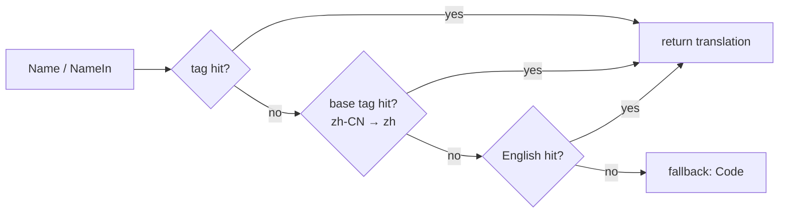

# currency

The `currency` package ships **ISO 4217 currency data**: alphabetic / numeric codes, symbols, and multi-language names (en/zh default + 7 extra languages via build tag). 154 strongly-typed constants, fully offline, single-binary.

## When to reach for it

- I18n cashier / billing / price rendering: show currency name per user language (人民币 / Yuan Renminbi / 元).
- Parse user input ("CNY" / "cny") into a single canonical `*currency.Currency`.
- Strongly-typed constants replace string literals: `currency.Cny` / `currency.Usd` / `currency.Eur`, compile-checked.
- Pairs naturally with [country](/en/modules/data/country): `country.China.Currency() == currency.Cny`.

## Data spec

| Dimension | Standard | Field |
|---|---|---|
| Alphabetic code | ISO 4217 | `Code()`, e.g. `"CNY"` |
| Symbol | Convention | `Symbol()`, e.g. `"¥"` |
| Numeric code | ISO 4217 | `Numeric()`, e.g. `156` |
| Name | Self-maintained multi-language | `Name()` / `NameIn(tag)` |

## Lookup API

```go
import "github.com/lazygophers/utils/currency"

cny := currency.Get("CNY")
cny = currency.Get("cny")             // same pointer
cny = currency.GetByNumeric(156)
all := currency.List()                // []*Currency

_ = currency.Cny == currency.Get("CNY") // true
_ = currency.Usd
_ = currency.Eur
```

Returns `nil` on miss.

## Currency methods

| Method | Returns | Notes |
|---|---|---|
| `Code()` | `string` | ISO 4217 alphabetic |
| `Symbol()` | `string` | Conventional symbol |
| `Numeric()` | `int` | ISO 4217 numeric |
| `Name()` | `string` | Currency name, current goroutine language |
| `NameIn(tag)` | `string` | Explicit `xlanguage.Tag` |
| `RegisterName(tag, name)` | — | Register translation (used by locale file init) |
| `String()` | `string` | Same as `Code()` |

## Localization



- All public API tag parameters use stdlib `golang.org/x/text/language.Tag`.
- **One currency per data file** `currency/<code>.go`: `var Cny = New("CNY", "¥", 156)`.
- **One file per language**: `currency/<code>_<lang>.go`.
- **Default builds compile en/zh**: `<code>_en.go` / `<code>_zh.go` carry no build tag.
- **Extra languages opt in via build tags**: `zh-Hant` / `ja` / `ko` / `es` / `fr` / `ru` / `ar`, each `//go:build lang_<xx> || lang_all`.
- Currencies have **no official-language exemption** (unlike country).

## Examples

### Basic lookup

```go
import (
    "fmt"

    "github.com/lazygophers/utils/currency"
)

func main() {
    cny := currency.Get("CNY")
    fmt.Println(cny.Code(), cny.Symbol(), cny.Numeric())
    fmt.Println(cny.Name())
}
```

### Strongly-typed constants

```go
var defaultCcy = currency.Cny
```

### Per-goroutine language switching

```go
import (
    "github.com/lazygophers/utils/currency"
    "github.com/lazygophers/utils/language"
)

func render() {
    language.Set(language.Make("zh"))
    _ = currency.Cny.Name()  // 人民币

    language.Set(language.Make("en"))
    _ = currency.Cny.Name()  // Yuan Renminbi
}
```

### Pairing with country

```go
_ = country.China.Currency() == currency.Cny // true
```

## Constraints

- Data hardcoded in `.go` source (one currency per file); no embed/JSON/YAML.
- Runtime indexes read-only, lookups are zero-alloc.
- Slice accessors return copies.
- No dependency on `i18n` / `xerror` / `context.Context`.
- Public API tag parameters strictly use stdlib `xlanguage.Tag`.

## Related

- [country](/en/modules/data/country)
- [language](/en/modules/core/language)
- [i18n](/en/modules/core/i18n)
