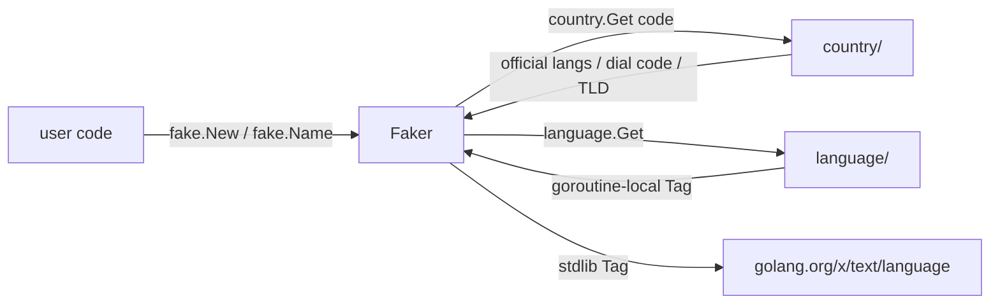

# fake

`fake` generates **country-aware fake data**: names, ID numbers, phone, addresses, emails, UUIDs, Lorem text, random time/numeric values. Tightly coupled to [`country`](../system/) and [`language`](../system/); together with [`randx`](./randx) it forms a clear split between "low-level randomness" and "business-shaped fake data".

## When to use it

- **Unit / integration test fixtures** — produce a valid-looking name / ID / phone without hand-written constants.
- **Demo and sample data** — UI previews, doc snippets, frontend mocks.
- **Load-test data generation** — seedable and reproducible, easy to replay.
- **Local dev DB seeding** — 249-country skeleton, extend per country as needed.

## How it differs from randx

| Aspect | randx | fake |
| --- | --- | --- |
| Abstraction level | Low-level RNG (int / float / bool / bytes) | Business entities (names, addresses, ID numbers) |
| Country/language aware | No | Yes — keyed by `country.Code`, uses `language` goroutine-local tag |
| Reproducibility | Process-global | Per-instance seed; `WithSeed(42)` is fully deterministic |
| Typical caller | Data processing / algorithms / sampling | Tests / demos / mocks |

For atomic randomness, use randx; for "give me a plausible Chinese user", use fake.

## Highlights

- **249-country skeleton** — every ISO 3166-1 country has a data file placeholder; CN / US / JP ship real data, others fall back through their official-language pool to en.
- **Locale aware** — picks the language based on `country.OfficialLanguages`; no need to pass lang manually.
- **Reproducible** — `fake.WithSeed(int64)` uses `math/rand/v2` PCG; identical seeds yield identical sequences.
- **Dual API** — explicit instance `fake.New(country.China)` or global `fake.Name()` (infers country from goroutine-local language).
- **Zero-alloc hot path** — `Name()` ≤ 200 ns/op, UUIDv4 ≤ 100 ns/op.

## Quick start

```go
import (
    "fmt"
    "github.com/lazygophers/utils/country"
    "github.com/lazygophers/utils/fake"
)

f := fake.New(country.China)
fmt.Println(f.Name())     // 张伟
fmt.Println(f.Phone())    // +86 138-xxxx-xxxx
fmt.Println(f.IdCard())   // 18-digit ID with valid checksum
fmt.Println(f.Email())    // alice.smith@gmail.com
fmt.Println(f.FullAddress())
```

## Global functions vs explicit instance

```go
// Global: country inferred from language.Get()
fake.Name()                              // default en → English name
language.Set(language.Chinese)
fake.Name()                              // → Chinese name

// One-shot country override (chained)
fake.WithCountry(country.Japan).Name()   // Japanese name

// Explicit instance (recommended for tests — controllable)
f := fake.New(country.Japan)
f.Name()
```

Global helpers cache per-country default Fakers in a `sync.Map` pool to avoid repeated construction.

## Reproducibility (WithSeed)

```go
a := fake.New(country.China, fake.WithSeed(42))
b := fake.New(country.China, fake.WithSeed(42))
// With the same seed, a and b produce identical output sequences
a.Name() == b.Name()     // true
a.IdCard() == b.IdCard() // true
```

Seeded instances carry an internal Mutex for concurrent safety; the default global instance relies on `math/rand/v2`'s thread-safe global source.

## API cheat sheet

| Group | Functions |
| --- | --- |
| Identity | `Name` / `FirstName` / `LastName` / `Username` / `Gender` |
| Documents | `IdCard` / `PassportNo` / `Birthday` |
| Contact | `Email` / `Phone` / `Tel` / `CallingCode` |
| Address | `Province` / `City` / `District` / `Street` / `ZipCode` / `Latitude` / `Longitude` / `FullAddress` |
| Network | `UUIDv4` / `UUIDv7` / `IPv4` / `IPv6` / `Mac` / `Md5Hex` / `Sha1Hex` / `Sha256Hex` / `Domain` / `UserAgent` / `Url` |
| Text | `Word` / `Sentence` / `Paragraph` / `ChineseWord` / `ChineseSentence` / `ChineseParagraph` |
| Time & numeric | `Date` / `Time` / `IntRange` / `Int64Range` / `Float64Range` / `Bool` / `Pick[T]` / `Sample[T]` / `Shuffle[T]` |
| Color & file | `HexColor` / `RgbColor` / `HslColor` / `FileName` / `FileExt` / `MimeType` |

## Integration with country / language



- `country` supplies static metadata (official languages, dialing code, TLD); fake does not duplicate it.
- `language` exposes the goroutine-local Tag from which global helpers infer the default country (zh → CN, en → US, ja → JP).
- Public APIs expose `language.Tag` (stdlib); the internal `utils/language` types are never leaked.

## Country coverage

| Country | Status | Notes |
| --- | --- | --- |
| CN (China) | Real data | 100+ surnames, 200+ given names per gender, 34 provinces + 300+ cities, GB 11643 ID checksum |
| US (United States) | Real data | 500+ first/last names, 50 state capitals + major cities, SSN `xxx-xx-xxxx` |
| JP (Japan) | Real data (build tag `lang_ja` or `lang_all`) | Kanji + hiragana names, 47 prefectures, My Number |
| Other 246 countries | Skeleton placeholder | Dial code / TLD sourced from `country`; names/places fall back to official-language pool or en |

New countries land via incremental PRs: `fake/data/<code>.go` (skeleton) + `fake/data/<code>_<lang>.go` (language data); build tag rules mirror `country` / `currency`.

## Caveats

- **Not a crypto-safe RNG.** For security-sensitive use cases (tokens, keys, nonces) use `crypto/rand` or [`cryptox`](../network/cryptox).
- `IdCard` / `Ssn` / `My Number` only satisfy **format and checksum rules** — they never correspond to a real person. Do not use them for identity verification.
- Skeleton data for the remaining 246 countries is filled out incrementally by the community; current fallback does not guarantee cultural fidelity.
- Default global instances share the `math/rand/v2` global source; for strict reproducibility use `New(country, WithSeed(...))`.

## Related docs

- [randx](./randx) — low-level RNG
- [defaults](./defaults) — struct default values
- [country module](../system/) — country metadata
