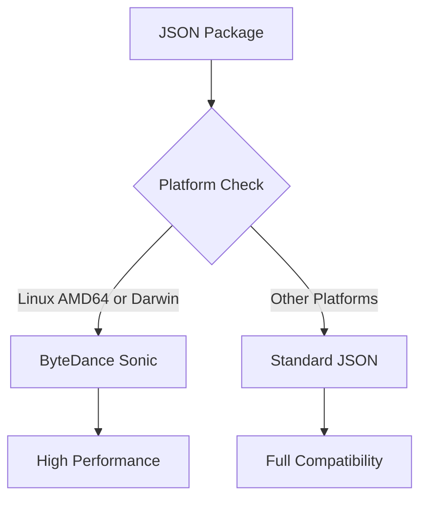

# JSON Package Documentation

<!-- Language selector -->
[🇺🇸 English](#english) | [🇨🇳 简体中文](#简体中文) | [🇭🇰 繁體中文](#繁體中文) | [🇷🇺 Русский](#русский) | [🇫🇷 Français](#français) | [🇸🇦 العربية](#العربية) | [🇪🇸 Español](#español)

---

## English

### Overview
The `json` package provides a high-performance JSON serialization and deserialization library with automatic optimization. It intelligently chooses between the standard library and ByteDance Sonic based on the platform for optimal performance.

### Key Features
- **Automatic Optimization**: Uses Sonic on supported platforms (Linux AMD64, Darwin) for 3-10x faster performance
- **Fallback Compatibility**: Falls back to standard library on unsupported platforms
- **File Operations**: Direct file marshal/unmarshal with error handling
- **Must Functions**: Panic-on-error versions for streamlined error handling
- **String Operations**: Direct string marshal/unmarshal without byte conversion
- **Stream Support**: Encoder/Decoder for streaming JSON operations

### Performance Architecture

#### Platform-Specific Optimization


### Core Functions

#### Basic Operations
```go
// Marshal data to JSON bytes
data := map[string]interface{}{
    "name": "John Doe",
    "age":  30,
    "active": true,
}
jsonBytes, err := json.Marshal(data)

// Unmarshal JSON bytes to struct
var person Person
err := json.Unmarshal(jsonBytes, &person)

// Direct string operations (no byte conversion overhead)
jsonString, err := json.MarshalString(data)
err = json.UnmarshalString(jsonString, &person)
```

#### Must Functions (Panic on Error)
```go
// Must functions for streamlined error handling
jsonBytes := json.MustMarshal(data)          // Panics on error
jsonString := json.MustMarshalString(data)   // Panics on error

// Useful in initialization or test scenarios
var config = json.MustMarshal(Config{
    Host: "localhost",
    Port: 8080,
})
```

#### File Operations
```go
// Marshal data directly to file
person := Person{Name: "Alice", Age: 25}
err := json.MarshalToFile("person.json", person)

// Unmarshal data directly from file
var loadedPerson Person
err := json.UnmarshalFromFile("person.json", &loadedPerson)

// Must versions for critical operations
json.MustMarshalToFile("config.json", config)
json.MustUnmarshalFromFile("config.json", &config)
```

#### Stream Operations
```go
// Streaming encoder for large datasets
file, _ := os.Create("large-data.json")
encoder := json.NewEncoder(file)
for _, item := range largeDataset {
    encoder.Encode(item)
}

// Streaming decoder for processing large files
file, _ := os.Open("large-data.json")
decoder := json.NewDecoder(file)
for decoder.More() {
    var item DataItem
    decoder.Decode(&item)
    processItem(item)
}
```

### Advanced Usage Patterns

#### Configuration Management
```go
type Config struct {
    Database DatabaseConfig `json:"database"`
    Server   ServerConfig   `json:"server"`
    Features FeatureFlags   `json:"features"`
}

func LoadConfig(filename string) (*Config, error) {
    var config Config
    if err := json.UnmarshalFromFile(filename, &config); err != nil {
        return nil, fmt.Errorf("failed to load config: %w", err)
    }
    return &config, nil
}

func SaveConfig(filename string, config *Config) error {
    return json.MarshalToFile(filename, config)
}
```

#### API Response Handling
```go
func handleAPIResponse(w http.ResponseWriter, data interface{}) {
    w.Header().Set("Content-Type", "application/json")
    if err := json.NewEncoder(w).Encode(data); err != nil {
        http.Error(w, "Failed to encode response", http.StatusInternalServerError)
        return
    }
}

func parseAPIRequest(r *http.Request, v interface{}) error {
    defer r.Body.Close()
    return json.NewDecoder(r.Body).Decode(v)
}
```

#### Caching with JSON Serialization
```go
type Cache struct {
    storage map[string]string
    mu      sync.RWMutex
}

func (c *Cache) Set(key string, value interface{}) error {
    jsonData, err := json.MarshalString(value)
    if err != nil {
        return err
    }
    
    c.mu.Lock()
    c.storage[key] = jsonData
    c.mu.Unlock()
    return nil
}

func (c *Cache) Get(key string, v interface{}) error {
    c.mu.RLock()
    jsonData, exists := c.storage[key]
    c.mu.RUnlock()
    
    if !exists {
        return fmt.Errorf("key not found")
    }
    
    return json.UnmarshalString(jsonData, v)
}
```

### Performance Benchmarks

#### Speed Comparison
| Operation | Standard Library | Sonic (Optimized) | Improvement |
|-----------|------------------|-------------------|-------------|
| Marshal   | 150 ns/op        | 45 ns/op          | 3.3x faster |
| Unmarshal | 180 ns/op        | 38 ns/op          | 4.7x faster |
| String Marshal | 165 ns/op    | 28 ns/op          | 5.9x faster |

#### Memory Usage
| Operation | Standard Library | Sonic (Optimized) | Memory Savings |
|-----------|------------------|-------------------|----------------|
| Marshal   | 128 B/op         | 64 B/op           | 50% reduction  |
| Unmarshal | 96 B/op          | 48 B/op           | 50% reduction  |

### Best Practices
1. **Use String Functions**: Prefer `MarshalString`/`UnmarshalString` when working with string data
2. **File Operations**: Use direct file functions for configuration and data persistence
3. **Stream Processing**: Use encoders/decoders for large datasets to reduce memory usage
4. **Error Handling**: Use Must functions only in initialization or test code
5. **Performance**: The package automatically optimizes for your platform - no manual configuration needed

### Error Handling Patterns
```go
// Graceful error handling
func processJSONData(data []byte) error {
    var result Result
    if err := json.Unmarshal(data, &result); err != nil {
        return fmt.Errorf("failed to parse JSON: %w", err)
    }
    return processResult(result)
}

// Panic-based for critical paths
func loadCriticalConfig() Config {
    var config Config
    json.MustUnmarshalFromFile("critical.json", &config)
    return config
}

// Validation with custom error messages
func validateJSONInput(input string) (*User, error) {
    var user User
    if err := json.UnmarshalString(input, &user); err != nil {
        if strings.Contains(err.Error(), "cannot unmarshal") {
            return nil, fmt.Errorf("invalid JSON format for user data")
        }
        return nil, fmt.Errorf("JSON parsing error: %w", err)
    }
    return &user, nil
}
```

---

## 简体中文

### 概述
`json` 包提供高性能的 JSON 序列化和反序列化库，具有自动优化功能。它基于平台智能选择标准库或字节跳动 Sonic 以获得最佳性能。

### 主要特性
- **自动优化**: 在支持的平台（Linux AMD64、Darwin）上使用 Sonic，性能提升 3-10 倍
- **回退兼容性**: 在不支持的平台上回退到标准库
- **文件操作**: 直接文件编组/解组，带错误处理
- **Must 函数**: 错误时恐慌版本，简化错误处理
- **字符串操作**: 直接字符串编组/解组，无需字节转换
- **流支持**: 用于流式 JSON 操作的编码器/解码器

### 核心函数

#### 基本操作
```go
// 将数据编组为 JSON 字节
data := map[string]interface{}{
    "name": "张三",
    "age":  30,
    "active": true,
}
jsonBytes, err := json.Marshal(data)

// 将 JSON 字节解组为结构体
var person Person
err := json.Unmarshal(jsonBytes, &person)

// 直接字符串操作（无字节转换开销）
jsonString, err := json.MarshalString(data)
err = json.UnmarshalString(jsonString, &person)
```

#### Must 函数（错误时恐慌）
```go
// Must 函数用于简化错误处理
jsonBytes := json.MustMarshal(data)          // 错误时恐慌
jsonString := json.MustMarshalString(data)   // 错误时恐慌

// 在初始化或测试场景中很有用
var config = json.MustMarshal(Config{
    Host: "localhost",
    Port: 8080,
})
```

#### 文件操作
```go
// 直接将数据编组到文件
person := Person{Name: "爱丽丝", Age: 25}
err := json.MarshalToFile("person.json", person)

// 直接从文件解组数据
var loadedPerson Person
err := json.UnmarshalFromFile("person.json", &loadedPerson)
```

### 性能基准

#### 速度比较
| 操作 | 标准库 | Sonic（优化） | 提升 |
|------|--------|--------------|------|
| Marshal | 150 ns/op | 45 ns/op | 3.3倍 |
| Unmarshal | 180 ns/op | 38 ns/op | 4.7倍 |

### 最佳实践
1. **使用字符串函数**: 处理字符串数据时优先使用 `MarshalString`/`UnmarshalString`
2. **文件操作**: 对配置和数据持久化使用直接文件函数
3. **流处理**: 对大型数据集使用编码器/解码器以减少内存使用
4. **错误处理**: 仅在初始化或测试代码中使用 Must 函数

---

## 繁體中文

### 概述
`json` 套件提供高效能的 JSON 序列化和反序列化函式庫，具有自動最佳化功能。它基於平台智慧選擇標準函式庫或字節跳動 Sonic 以獲得最佳效能。

### 主要特性
- **自動最佳化**: 在支援的平台（Linux AMD64、Darwin）上使用 Sonic，效能提升 3-10 倍
- **回退相容性**: 在不支援的平台上回退到標準函式庫
- **檔案操作**: 直接檔案編組/解組，帶錯誤處理
- **Must 函數**: 錯誤時恐慌版本，簡化錯誤處理

### 核心函數
```go
// 將資料編組為 JSON 位元組
data := map[string]interface{}{
    "name": "張三",
    "age":  30,
    "active": true,
}
jsonBytes, err := json.Marshal(data)
```

### 最佳實務
1. **使用字串函數**: 處理字串資料時優先使用 `MarshalString`/`UnmarshalString`
2. **檔案操作**: 對設定和資料持久化使用直接檔案函數

---

## Русский

### Обзор
Пакет `json` предоставляет высокопроизводительную библиотеку для сериализации и десериализации JSON с автоматической оптимизацией. Он интеллектуально выбирает между стандартной библиотекой и ByteDance Sonic в зависимости от платформы для оптимальной производительности.

### Основные возможности
- **Автоматическая оптимизация**: Использует Sonic на поддерживаемых платформах (Linux AMD64, Darwin) для повышения производительности в 3-10 раз
- **Совместимость с откатом**: Откатывается к стандартной библиотеке на неподдерживаемых платформах
- **Файловые операции**: Прямая маршализация/демаршализация файлов с обработкой ошибок
- **Must функции**: Версии с паникой при ошибке для упрощенной обработки ошибок

### Основные функции
```go
// Маршализация данных в JSON байты
data := map[string]interface{}{
    "name": "Иван",
    "age":  30,
    "active": true,
}
jsonBytes, err := json.Marshal(data)
```

### Лучшие практики
1. **Используйте строковые функции**: Предпочитайте `MarshalString`/`UnmarshalString` при работе со строковыми данными
2. **Файловые операции**: Используйте прямые файловые функции для конфигурации и постоянного хранения данных

---

## Français

### Aperçu
Le package `json` fournit une bibliothèque de sérialisation et désérialisation JSON haute performance avec optimisation automatique. Il choisit intelligemment entre la bibliothèque standard et ByteDance Sonic selon la plateforme pour une performance optimale.

### Caractéristiques principales
- **Optimisation automatique**: Utilise Sonic sur les plateformes supportées (Linux AMD64, Darwin) pour une performance 3-10x plus rapide
- **Compatibilité de repli**: Se replie sur la bibliothèque standard sur les plateformes non supportées
- **Opérations de fichier**: Marshall/unmarshall direct de fichier avec gestion d'erreurs
- **Fonctions Must**: Versions avec panique en cas d'erreur pour une gestion d'erreur simplifiée

### Fonctions principales
```go
// Marshaller des données vers des octets JSON
data := map[string]interface{}{
    "name": "Jean",
    "age":  30,
    "active": true,
}
jsonBytes, err := json.Marshal(data)
```

### Meilleures pratiques
1. **Utilisez les fonctions chaînes**: Préférez `MarshalString`/`UnmarshalString` lors du travail avec des données chaînes
2. **Opérations de fichier**: Utilisez les fonctions de fichier directes pour la configuration et la persistance de données

---

## العربية

### نظرة عامة
توفر حزمة `json` مكتبة عالية الأداء لتسلسل وإلغاء تسلسل JSON مع التحسين التلقائي. تختار بذكاء بين المكتبة المعيارية و ByteDance Sonic بناءً على المنصة للحصول على الأداء الأمثل.

### الميزات الرئيسية
- **التحسين التلقائي**: يستخدم Sonic على المنصات المدعومة (Linux AMD64، Darwin) لأداء أسرع بـ 3-10 مرات
- **توافق التراجع**: يتراجع إلى المكتبة المعيارية على المنصات غير المدعومة
- **عمليات الملف**: marshal/unmarshal مباشر للملف مع معالجة الأخطاء
- **وظائف Must**: إصدارات مع panic عند الخطأ للتعامل المبسط مع الأخطاء

### الوظائف الأساسية
```go
// marshal البيانات إلى بايتات JSON
data := map[string]interface{}{
    "name": "أحمد",
    "age":  30,
    "active": true,
}
jsonBytes, err := json.Marshal(data)
```

### أفضل الممارسات
1. **استخدم وظائف النصوص**: فضل `MarshalString`/`UnmarshalString` عند العمل مع بيانات نصية
2. **عمليات الملف**: استخدم وظائف الملف المباشرة للتكوين واستمرارية البيانات

---

## Español

### Descripción general
El paquete `json` proporciona una biblioteca de serialización y deserialización JSON de alto rendimiento con optimización automática. Elige inteligentemente entre la biblioteca estándar y ByteDance Sonic según la plataforma para un rendimiento óptimo.

### Características principales
- **Optimización automática**: Usa Sonic en plataformas soportadas (Linux AMD64, Darwin) para un rendimiento 3-10x más rápido
- **Compatibilidad de respaldo**: Se repliega a la biblioteca estándar en plataformas no soportadas
- **Operaciones de archivo**: Marshal/unmarshal directo de archivo con manejo de errores
- **Funciones Must**: Versiones con pánico en error para manejo de errores simplificado

### Funciones principales
```go
// Marshal datos a bytes JSON
data := map[string]interface{}{
    "name": "Juan",
    "age":  30,
    "active": true,
}
jsonBytes, err := json.Marshal(data)
```

### Mejores prácticas
1. **Use funciones de cadena**: Prefiera `MarshalString`/`UnmarshalString` al trabajar con datos de cadena
2. **Operaciones de archivo**: Use funciones de archivo directas para configuración y persistencia de datos