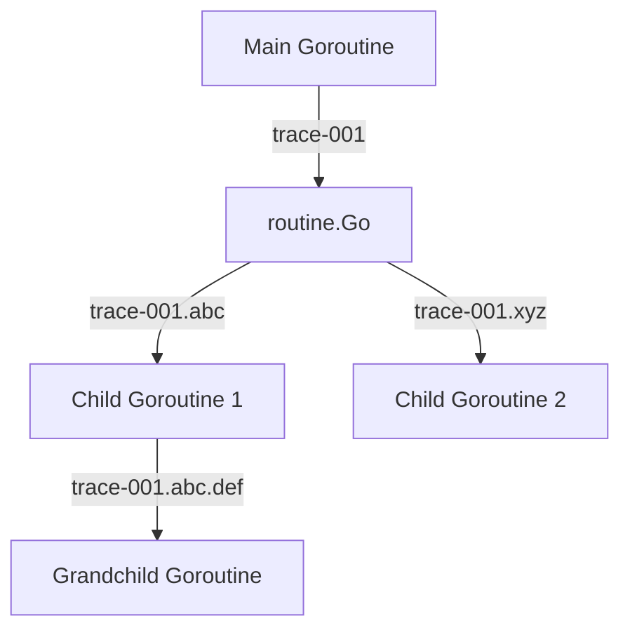

# Routine Package Documentation

<!-- Language selector -->
[🇺🇸 English](#english) | [🇨🇳 简体中文](#简体中文) | [🇭🇰 繁體中文](#繁體中文) | [🇷🇺 Русский](#русский) | [🇫🇷 Français](#français) | [🇸🇦 العربية](#العربية) | [🇪🇸 Español](#español)

---

## English

### Overview
The `routine` package provides enhanced goroutine management with built-in logging, tracing, error handling, and lifecycle hooks. It offers safe alternatives to the standard `go` keyword with additional monitoring and debugging capabilities.

### Key Features
- **Enhanced Goroutine Management**: Safe goroutine creation with error handling
- **Automatic Tracing**: Built-in trace ID propagation across goroutines
- **Panic Recovery**: Optional panic recovery with stack trace logging
- **Lifecycle Hooks**: Before and after routine execution callbacks
- **Error Handling**: Comprehensive error logging and handling strategies
- **GID Tracking**: Goroutine ID tracking for debugging and monitoring

### Core Functions

#### Basic Goroutine Creation
```go
// Go starts a goroutine with error logging
routine.Go(func() error {
    // Your goroutine logic here
    return performTask()
})

// GoWithRecover starts a goroutine with panic recovery
routine.GoWithRecover(func() error {
    // This goroutine will catch and log panics
    return riskyOperation()
})

// GoWithMustSuccess starts a goroutine that exits on error
routine.GoWithMustSuccess(func() error {
    // Critical operation - application exits on failure
    return criticalTask()
})
```

### Advanced Features

#### Lifecycle Hooks
```go
type BeforeRoutine func(baseGid, currentGid int64)
type AfterRoutine func(currentGid int64)

// Add custom before-routine hook
routine.AddBeforeRoutine(func(baseGid, currentGid int64) {
    log.Printf("Starting goroutine %d from parent %d", currentGid, baseGid)
})

// Add custom after-routine hook
routine.AddAfterRoutine(func(currentGid int64) {
    log.Printf("Goroutine %d finished", currentGid)
})
```

#### Trace Propagation


### Usage Patterns

#### Error Handling Strategies
```go
// Pattern 1: Log and continue
routine.Go(func() error {
    if err := processData(); err != nil {
        return fmt.Errorf("failed to process data: %w", err)
    }
    return nil
})

// Pattern 2: Critical operations with panic recovery
routine.GoWithRecover(func() error {
    // Operations that might panic
    result := riskyCalculation()
    return saveResult(result)
})

// Pattern 3: Mission-critical operations
routine.GoWithMustSuccess(func() error {
    // System must exit if this fails
    return initializeCriticalService()
})
```

#### Concurrent Task Processing
```go
func processItems(items []Item) {
    for _, item := range items {
        item := item // Capture loop variable
        routine.Go(func() error {
            return processItem(item)
        })
    }
}

// With error collection
func processItemsWithErrors(items []Item) []error {
    var errors []error
    var mu sync.Mutex
    var wg sync.WaitGroup
    
    for _, item := range items {
        wg.Add(1)
        item := item
        routine.Go(func() error {
            defer wg.Done()
            if err := processItem(item); err != nil {
                mu.Lock()
                errors = append(errors, err)
                mu.Unlock()
                return err
            }
            return nil
        })
    }
    
    wg.Wait()
    return errors
}
```

### Integration Examples

#### HTTP Handler with Background Processing
```go
func handleRequest(w http.ResponseWriter, r *http.Request) {
    // Process request immediately
    response := processRequestSync(r)
    w.WriteHeader(http.StatusOK)
    json.NewEncoder(w).Encode(response)
    
    // Background processing
    routine.Go(func() error {
        return performBackgroundTasks(r)
    })
}
```

#### Worker Pool Pattern
```go
type WorkerPool struct {
    workers int
    jobs    chan Job
}

func (wp *WorkerPool) Start() {
    wp.jobs = make(chan Job, 100)
    
    for i := 0; i < wp.workers; i++ {
        routine.Go(func() error {
            return wp.worker()
        })
    }
}

func (wp *WorkerPool) worker() error {
    for job := range wp.jobs {
        if err := job.Process(); err != nil {
            return fmt.Errorf("job processing failed: %w", err)
        }
    }
    return nil
}
```

#### Database Operation with Retry
```go
func performDatabaseOperation() {
    routine.GoWithRecover(func() error {
        maxRetries := 3
        for i := 0; i < maxRetries; i++ {
            if err := database.Execute(query); err != nil {
                if i == maxRetries-1 {
                    return fmt.Errorf("database operation failed after %d retries: %w", maxRetries, err)
                }
                time.Sleep(time.Second * time.Duration(i+1))
                continue
            }
            return nil
        }
        return nil
    })
}
```

### Best Practices
1. **Always Handle Errors**: Use appropriate error handling strategy for your use case
2. **Use GoWithRecover for Risky Operations**: When calling external code or performing complex operations
3. **Reserve GoWithMustSuccess for Critical Operations**: Only for operations where failure should terminate the application
4. **Leverage Trace Propagation**: Automatic trace ID propagation helps with debugging distributed operations
5. **Monitor Goroutine Lifecycle**: Use hooks for custom monitoring and metrics collection

### Common Patterns
```go
// Service initialization
func (s *Service) Start() {
    routine.GoWithMustSuccess(func() error {
        return s.initializeDatabase()
    })
    
    routine.GoWithRecover(func() error {
        return s.startMetricsCollector()
    })
    
    routine.Go(func() error {
        return s.startBackgroundCleanup()
    })
}

// Event processing
func (e *EventProcessor) ProcessAsync(event Event) {
    routine.Go(func() error {
        if err := e.validate(event); err != nil {
            return fmt.Errorf("event validation failed: %w", err)
        }
        
        if err := e.process(event); err != nil {
            return fmt.Errorf("event processing failed: %w", err)
        }
        
        return e.notify(event)
    })
}
```

---

## 简体中文

### 概述
`routine` 包提供增强的 goroutine 管理，内置日志记录、跟踪、错误处理和生命周期钩子。它为标准 `go` 关键字提供了具有额外监控和调试功能的安全替代方案。

### 主要特性
- **增强的 Goroutine 管理**: 具有错误处理的安全 goroutine 创建
- **自动跟踪**: 内置跨 goroutine 的跟踪 ID 传播
- **恐慌恢复**: 可选的恐慌恢复与堆栈跟踪日志记录
- **生命周期钩子**: 例程执行前后的回调函数
- **错误处理**: 全面的错误日志记录和处理策略
- **GID 跟踪**: 用于调试和监控的 Goroutine ID 跟踪

### 核心函数

#### 基本 Goroutine 创建
```go
// Go 启动带有错误日志记录的 goroutine
routine.Go(func() error {
    // 您的 goroutine 逻辑
    return performTask()
})

// GoWithRecover 启动带有恐慌恢复的 goroutine
routine.GoWithRecover(func() error {
    // 此 goroutine 将捕获并记录恐慌
    return riskyOperation()
})

// GoWithMustSuccess 启动在错误时退出的 goroutine
routine.GoWithMustSuccess(func() error {
    // 关键操作 - 失败时应用程序退出
    return criticalTask()
})
```

### 高级特性

#### 生命周期钩子
```go
type BeforeRoutine func(baseGid, currentGid int64)
type AfterRoutine func(currentGid int64)

// 添加自定义前置钩子
routine.AddBeforeRoutine(func(baseGid, currentGid int64) {
    log.Printf("从父进程 %d 启动 goroutine %d", baseGid, currentGid)
})

// 添加自定义后置钩子
routine.AddAfterRoutine(func(currentGid int64) {
    log.Printf("Goroutine %d 完成", currentGid)
})
```

### 使用模式

#### 错误处理策略
```go
// 模式 1: 记录并继续
routine.Go(func() error {
    if err := processData(); err != nil {
        return fmt.Errorf("处理数据失败: %w", err)
    }
    return nil
})

// 模式 2: 带恐慌恢复的关键操作
routine.GoWithRecover(func() error {
    // 可能引发恐慌的操作
    result := riskyCalculation()
    return saveResult(result)
})
```

### 最佳实践
1. **始终处理错误**: 为您的用例使用适当的错误处理策略
2. **对风险操作使用 GoWithRecover**: 调用外部代码或执行复杂操作时
3. **将 GoWithMustSuccess 保留给关键操作**: 仅用于失败时应该终止应用程序的操作
4. **利用跟踪传播**: 自动跟踪 ID 传播有助于调试分布式操作

---

## 繁體中文

### 概述
`routine` 套件提供增強的 goroutine 管理，內建日誌記錄、追蹤、錯誤處理和生命週期鉤子。它為標準 `go` 關鍵字提供了具有額外監控和除錯功能的安全替代方案。

### 主要特性
- **增強的 Goroutine 管理**: 具有錯誤處理的安全 goroutine 建立
- **自動追蹤**: 內建跨 goroutine 的追蹤 ID 傳播
- **恐慌恢復**: 可選的恐慌恢復與堆疊追蹤日誌記錄
- **生命週期鉤子**: 例程執行前後的回呼函數

### 核心函數
```go
// Go 啟動帶有錯誤日誌記錄的 goroutine
routine.Go(func() error {
    // 您的 goroutine 邏輯
    return performTask()
})
```

### 最佳實務
1. **始終處理錯誤**: 為您的用例使用適當的錯誤處理策略
2. **對風險操作使用 GoWithRecover**: 呼叫外部程式碼或執行複雜操作時

---

## Русский

### Обзор
Пакет `routine` предоставляет улучшенное управление горутинами с встроенным логированием, трассировкой, обработкой ошибок и хуками жизненного цикла. Он предлагает безопасные альтернативы стандартному ключевому слову `go` с дополнительными возможностями мониторинга и отладки.

### Основные возможности
- **Улучшенное управление горутинами**: Безопасное создание горутин с обработкой ошибок
- **Автоматическая трассировка**: Встроенное распространение ID трассировки между горутинами
- **Восстановление после паники**: Опциональное восстановление после паники с логированием стека вызовов
- **Хуки жизненного цикла**: Обратные вызовы до и после выполнения рутины

### Основные функции
```go
// Go запускает горутину с логированием ошибок
routine.Go(func() error {
    // Логика вашей горутины
    return performTask()
})
```

### Лучшие практики
1. **Всегда обрабатывайте ошибки**: Используйте подходящую стратегию обработки ошибок для вашего случая использования
2. **Используйте GoWithRecover для рискованных операций**: При вызове внешнего кода или выполнении сложных операций

---

## Français

### Aperçu
Le package `routine` fournit une gestion améliorée des goroutines avec logging intégré, traçage, gestion d'erreurs et hooks de cycle de vie. Il offre des alternatives sûres au mot-clé standard `go` avec des capacités de monitoring et de débogage supplémentaires.

### Caractéristiques principales
- **Gestion améliorée des goroutines**: Création sécurisée de goroutines avec gestion d'erreurs
- **Traçage automatique**: Propagation intégrée d'ID de trace entre les goroutines
- **Récupération de panique**: Récupération optionnelle de panique avec logging de stack trace
- **Hooks de cycle de vie**: Callbacks avant et après l'exécution de routine

### Fonctions principales
```go
// Go démarre une goroutine avec logging d'erreurs
routine.Go(func() error {
    // Logique de votre goroutine
    return performTask()
})
```

### Meilleures pratiques
1. **Toujours gérer les erreurs**: Utilisez une stratégie de gestion d'erreurs appropriée pour votre cas d'usage
2. **Utilisez GoWithRecover pour les opérations risquées**: Lors de l'appel de code externe ou d'opérations complexes

---

## العربية

### نظرة عامة
توفر حزمة `routine` إدارة محسنة للـ goroutines مع تسجيل مدمج، وتتبع، ومعالجة أخطاء، وخطافات دورة الحياة. تقدم بدائل آمنة للكلمة المفتاحية المعيارية `go` مع قدرات إضافية للمراقبة والتصحيح.

### الميزات الرئيسية
- **إدارة محسنة للـ Goroutines**: إنشاء آمن للـ goroutines مع معالجة الأخطاء
- **التتبع التلقائي**: انتشار مدمج لمعرف التتبع عبر الـ goroutines
- **استرداد الذعر**: استرداد اختياري من الذعر مع تسجيل تتبع المكدس
- **خطافات دورة الحياة**: استدعاءات مرتدة قبل وبعد تنفيذ الروتين

### الوظائف الأساسية
```go
// Go تبدأ goroutine مع تسجيل الأخطاء
routine.Go(func() error {
    // منطق الـ goroutine الخاص بك
    return performTask()
})
```

### أفضل الممارسات
1. **تعامل دائماً مع الأخطاء**: استخدم استراتيجية معالجة أخطاء مناسبة لحالة الاستخدام الخاصة بك
2. **استخدم GoWithRecover للعمليات المحفوفة بالمخاطر**: عند استدعاء كود خارجي أو تنفيذ عمليات معقدة

---

## Español

### Descripción general
El paquete `routine` proporciona gestión mejorada de goroutines con logging integrado, trazado, manejo de errores y hooks del ciclo de vida. Ofrece alternativas seguras a la palabra clave estándar `go` con capacidades adicionales de monitoreo y depuración.

### Características principales
- **Gestión mejorada de goroutines**: Creación segura de goroutines con manejo de errores
- **Trazado automático**: Propagación integrada de ID de trace entre goroutines
- **Recuperación de pánico**: Recuperación opcional de pánico con logging de stack trace
- **Hooks del ciclo de vida**: Callbacks antes y después de la ejecución de rutina

### Funciones principales
```go
// Go inicia una goroutine con logging de errores
routine.Go(func() error {
    // Lógica de su goroutine
    return performTask()
})
```

### Mejores prácticas
1. **Siempre manejar errores**: Use una estrategia de manejo de errores apropiada para su caso de uso
2. **Use GoWithRecover para operaciones riesgosas**: Al llamar código externo o realizar operaciones complejas