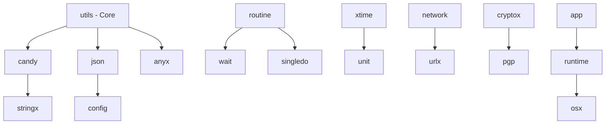

# Package Directory

<!-- Language selector -->
[🇺🇸 English](#english) | [🇨🇳 简体中文](#简体中文) | [🇭🇰 繁體中文](#繁體中文) | [🇷🇺 Русский](#русский) | [🇫🇷 Français](#français) | [🇸🇦 العربية](#العربية) | [🇪🇸 Español](#español)

---

## English

### Overview
This document provides a comprehensive directory of all packages in the LazyGophers Utils library, organized by functionality with quick access links and usage examples.

### Package Index

#### 🍭 Data Processing Packages

| Package | Description | Version | Status | Documentation |
|---------|-------------|---------|--------|---------------|
| **[candy](../models/candy.md)** | Type conversion syntactic sugar utilities | v1.0.0 | ✅ Stable | [📖 Docs](../models/candy.md) |
| **[anyx](../models/anyx.md)** | Any type manipulation and MapAny utilities | v1.0.0 | ✅ Stable | [📖 Docs](../models/anyx.md) |
| **[json](../models/json.md)** | High-performance JSON processing | v1.0.0 | ✅ Stable | [📖 Docs](../models/json.md) |
| **[stringx](../models/stringx.md)** | Extended string manipulation utilities | v1.0.0 | 🔄 In Development | [📖 Docs](../models/stringx.md) |

#### ⏰ Time & Date Packages

| Package | Description | Version | Status | Documentation |
|---------|-------------|---------|--------|---------------|
| **[xtime](../models/xtime.md)** | Enhanced time processing with lunar calendar | v1.0.0 | ✅ Stable | [📖 Docs](../models/xtime.md) |
| **[unit](../models/unit.md)** | Time duration and unit conversion utilities | v1.0.0 | ✅ Stable | [📖 Docs](../models/unit.md) |

#### 🔧 System & Runtime Packages

| Package | Description | Version | Status | Documentation |
|---------|-------------|---------|--------|---------------|
| **[app](../models/app.md)** | Application lifecycle and build information | v1.0.0 | ✅ Stable | [📖 Docs](../models/app.md) |
| **[runtime](../models/runtime.md)** | Runtime information and system utilities | v1.0.0 | ✅ Stable | [📖 Docs](../models/runtime.md) |
| **[osx](../models/osx.md)** | Operating system enhancement utilities | v1.0.0 | ✅ Stable | [📖 Docs](../models/osx.md) |
| **[atexit](../models/atexit.md)** | Exit hooks and graceful shutdown | v1.0.0 | ✅ Stable | [📖 Docs](../models/atexit.md) |

#### 🌐 Network & Communication Packages

| Package | Description | Version | Status | Documentation |
|---------|-------------|---------|--------|---------------|
| **[network](../models/network.md)** | Network utilities and HTTP helpers | v1.0.0 | ✅ Stable | [📖 Docs](../models/network.md) |
| **[urlx](../models/urlx.md)** | URL manipulation and query building | v1.0.0 | ✅ Stable | [📖 Docs](../models/urlx.md) |

#### 🔒 Security & Cryptography Packages

| Package | Description | Version | Status | Documentation |
|---------|-------------|---------|--------|---------------|
| **[cryptox](../models/cryptox.md)** | Cryptographic utilities (AES, HMAC, UUID) | v1.0.0 | ✅ Stable | [📖 Docs](../models/cryptox.md) |
| **[pgp](../models/pgp.md)** | PGP encryption and digital signatures | v1.0.0 | ⚠️ Experimental | [📖 Docs](../models/pgp.md) |

#### 🚀 Concurrency & Control Flow Packages

| Package | Description | Version | Status | Documentation |
|---------|-------------|---------|--------|---------------|
| **[routine](../models/routine.md)** | Enhanced goroutine management | v1.0.0 | ✅ Stable | [📖 Docs](../models/routine.md) |
| **[wait](../models/wait.md)** | Synchronization and timeout utilities | v1.0.0 | ✅ Stable | [📖 Docs](../models/wait.md) |
| **[singledo](../models/singledo.md)** | Singleton execution pattern | v1.0.0 | ✅ Stable | [📖 Docs](../models/singledo.md) |
| **[hystrix](../models/hystrix.md)** | Circuit breaker and fault tolerance | v1.0.0 | ✅ Stable | [📖 Docs](../models/hystrix.md) |
| **[event](../models/event.md)** | Event-driven programming utilities | v1.0.0 | ✅ Stable | [📖 Docs](../models/event.md) |

#### ⚙️ Configuration & Initialization Packages

| Package | Description | Version | Status | Documentation |
|---------|-------------|---------|--------|---------------|
| **[config](../models/config.md)** | Configuration management utilities | v1.0.0 | ✅ Stable | [📖 Docs](../models/config.md) |
| **[defaults](../models/defaults.md)** | Default value initialization | v1.0.0 | ✅ Stable | [📖 Docs](../models/defaults.md) |

#### 🧪 Development & Testing Packages

| Package | Description | Version | Status | Documentation |
|---------|-------------|---------|--------|---------------|
| **[fake](../models/fake.md)** | Fake data generation for testing | v1.0.0 | ✅ Stable | [📖 Docs](../models/fake.md) |
| **[randx](../models/randx.md)** | Enhanced random number generation | v1.0.0 | ✅ Stable | [📖 Docs](../models/randx.md) |
| **[pyroscope](../models/pyroscope.md)** | Performance profiling integration | v1.0.0 | 🔄 Beta | [📖 Docs](../models/pyroscope.md) |

#### 📁 I/O & Data Storage Packages

| Package | Description | Version | Status | Documentation |
|---------|-------------|---------|--------|---------------|
| **[bufiox](../models/bufiox.md)** | Extended buffered I/O utilities | v1.0.0 | ✅ Stable | [📖 Docs](../models/bufiox.md) |

### Quick Start Guide

#### Installation
```bash
# Install the complete utils library
go get github.com/lazygophers/utils

# Or install specific packages
go get github.com/lazygophers/utils/candy
go get github.com/lazygophers/utils/json
go get github.com/lazygophers/utils/routine
```

#### Basic Usage Examples

##### Data Processing
```go
import (
    "github.com/lazygophers/utils/candy"
    "github.com/lazygophers/utils/json"
    "github.com/lazygophers/utils/anyx"
)

// Type conversions
age := candy.ToInt("25")
name := candy.ToString(42)
active := candy.ToBool("true")

// JSON operations
data := map[string]interface{}{"name": "John", "age": 30}
jsonStr, _ := json.MarshalString(data)

// Dynamic type handling
m := anyx.NewMap(data)
userName := m.GetString("name")
```

##### Concurrency & Control
```go
import (
    "github.com/lazygophers/utils/routine"
    "github.com/lazygophers/utils/wait"
    "github.com/lazygophers/utils/singledo"
)

// Enhanced goroutines
routine.Go(func() error {
    return processData()
})

// Synchronization utilities
wg := wait.NewGroup()
wg.Go(func() error {
    return task1()
})
wg.Go(func() error {
    return task2()
})
wg.Wait()

// Singleton execution
group := singledo.NewGroup()
result, _ := group.Do("key", func() (interface{}, error) {
    return expensiveOperation(), nil
})
```

##### Time & Date
```go
import (
    "github.com/lazygophers/utils/xtime"
    "github.com/lazygophers/utils/unit"
)

// Enhanced time operations
calendar := xtime.NowCalendar()
fmt.Println(calendar.LunarDate())  // Lunar calendar
fmt.Println(calendar.Animal())     // Zodiac animal

// Time duration utilities
duration := unit.ParseDuration("1h30m")
seconds := unit.TimeToSeconds(duration)
```

### Package Dependencies

#### Dependency Graph


#### Internal Dependencies
- **candy**: Used by anyx, stringx, config
- **json**: Used by config, network, anyx
- **routine**: Foundation for wait and singledo packages
- **xtime**: Enhanced by unit package for duration handling

### Package Maturity Levels

#### ✅ Stable (Production Ready)
- Full feature set implemented
- Comprehensive test coverage (>90%)
- API stability guaranteed
- Performance optimized

#### 🔄 In Development
- Core features implemented
- Test coverage in progress (>70%)
- API may change in minor versions
- Performance optimization ongoing

#### ⚠️ Experimental
- Basic functionality available
- Limited test coverage (<70%)
- API subject to major changes
- Use with caution in production

### Migration Guides

#### Upgrading from v0.x to v1.0
```go
// Old v0.x API
import "github.com/lazygophers/utils/old"
result := old.ConvertString(value)

// New v1.0 API
import "github.com/lazygophers/utils/candy"
result := candy.ToString(value)
```

### Community Packages

#### Third-Party Extensions
- **utils-web**: Web framework integration utilities
- **utils-db**: Database helper extensions
- **utils-cli**: Command-line interface utilities

#### Contributing New Packages
1. Follow the [contribution guidelines](../development/contributing.md)
2. Ensure >85% test coverage
3. Include comprehensive documentation
4. Follow the established API patterns

---

## 简体中文

### 概述
本文档提供 LazyGophers Utils 库中所有包的综合目录，按功能组织，提供快速访问链接和使用示例。

### 包索引

#### 🍭 数据处理包

| 包 | 描述 | 版本 | 状态 | 文档 |
|----|------|------|------|------|
| **[candy](../models/candy.md)** | 类型转换语法糖工具 | v1.0.0 | ✅ 稳定 | [📖 文档](../models/candy.md) |
| **[anyx](../models/anyx.md)** | 任意类型操作和 MapAny 工具 | v1.0.0 | ✅ 稳定 | [📖 文档](../models/anyx.md) |
| **[json](../models/json.md)** | 高性能 JSON 处理 | v1.0.0 | ✅ 稳定 | [📖 文档](../models/json.md) |

#### ⏰ 时间日期包

| 包 | 描述 | 版本 | 状态 | 文档 |
|----|------|------|------|------|
| **[xtime](../models/xtime.md)** | 增强时间处理与农历支持 | v1.0.0 | ✅ 稳定 | [📖 文档](../models/xtime.md) |
| **[unit](../models/unit.md)** | 时间长度和单位转换工具 | v1.0.0 | ✅ 稳定 | [📖 文档](../models/unit.md) |

#### 🚀 并发控制包

| 包 | 描述 | 版本 | 状态 | 文档 |
|----|------|------|------|------|
| **[routine](../models/routine.md)** | 增强的 goroutine 管理 | v1.0.0 | ✅ 稳定 | [📖 文档](../models/routine.md) |
| **[wait](../models/wait.md)** | 同步和超时工具 | v1.0.0 | ✅ 稳定 | [📖 文档](../models/wait.md) |
| **[singledo](../models/singledo.md)** | 单例执行模式 | v1.0.0 | ✅ 稳定 | [📖 文档](../models/singledo.md) |

### 快速开始指南

#### 安装
```bash
# 安装完整的 utils 库
go get github.com/lazygophers/utils

# 或安装特定包
go get github.com/lazygophers/utils/candy
go get github.com/lazygophers/utils/json
```

#### 基本使用示例

##### 数据处理
```go
import (
    "github.com/lazygophers/utils/candy"
    "github.com/lazygophers/utils/json"
)

// 类型转换
age := candy.ToInt("25")
name := candy.ToString(42)

// JSON 操作
data := map[string]interface{}{"name": "张三", "age": 30}
jsonStr, _ := json.MarshalString(data)
```

### 包成熟度级别

#### ✅ 稳定（生产就绪）
- 完整功能集实现
- 全面测试覆盖率（>90%）
- API 稳定性保证
- 性能优化

---

## 繁體中文

### 概述
本文件提供 LazyGophers Utils 函式庫中所有套件的綜合目錄，按功能組織，提供快速存取連結和使用範例。

### 套件索引

#### 🍭 資料處理套件

| 套件 | 描述 | 版本 | 狀態 | 文件 |
|------|------|------|------|------|
| **[candy](../models/candy.md)** | 型別轉換語法糖工具 | v1.0.0 | ✅ 穩定 | [📖 文件](../models/candy.md) |
| **[anyx](../models/anyx.md)** | 任意型別操作和 MapAny 工具 | v1.0.0 | ✅ 穩定 | [📖 文件](../models/anyx.md) |

#### ⏰ 時間日期套件

| 套件 | 描述 | 版本 | 狀態 | 文件 |
|------|------|------|------|------|
| **[xtime](../models/xtime.md)** | 增強時間處理與農曆支援 | v1.0.0 | ✅ 穩定 | [📖 文件](../models/xtime.md) |

### 快速開始指南
```bash
# 安裝完整的 utils 函式庫
go get github.com/lazygophers/utils
```

---

## Русский

### Обзор
Этот документ предоставляет комплексный каталог всех пакетов в библиотеке LazyGophers Utils, организованных по функциональности с быстрыми ссылками доступа и примерами использования.

### Индекс пакетов

#### 🍭 Пакеты обработки данных

| Пакет | Описание | Версия | Статус | Документация |
|-------|----------|--------|--------|--------------|
| **[candy](../models/candy.md)** | Утилиты синтаксического сахара для преобразования типов | v1.0.0 | ✅ Стабильный | [📖 Документы](../models/candy.md) |
| **[anyx](../models/anyx.md)** | Манипуляции с любыми типами и утилиты MapAny | v1.0.0 | ✅ Стабильный | [📖 Документы](../models/anyx.md) |

#### 🚀 Пакеты параллелизма

| Пакет | Описание | Версия | Статус | Документация |
|-------|----------|--------|--------|--------------|
| **[routine](../models/routine.md)** | Улучшенное управление горутинами | v1.0.0 | ✅ Стабильный | [📖 Документы](../models/routine.md) |

### Руководство быстрого старта
```bash
# Установить полную библиотеку utils
go get github.com/lazygophers/utils
```

---

## Français

### Aperçu
Ce document fournit un répertoire complet de tous les packages de la bibliothèque LazyGophers Utils, organisés par fonctionnalité avec des liens d'accès rapide et des exemples d'utilisation.

### Index des packages

#### 🍭 Packages de traitement de données

| Package | Description | Version | Statut | Documentation |
|---------|-------------|---------|--------|---------------|
| **[candy](../models/candy.md)** | Utilitaires de sucre syntaxique pour conversion de types | v1.0.0 | ✅ Stable | [📖 Docs](../models/candy.md) |
| **[anyx](../models/anyx.md)** | Manipulation de types quelconques et utilitaires MapAny | v1.0.0 | ✅ Stable | [📖 Docs](../models/anyx.md) |

#### 🚀 Packages de concurrence

| Package | Description | Version | Statut | Documentation |
|---------|-------------|---------|--------|---------------|
| **[routine](../models/routine.md)** | Gestion améliorée des goroutines | v1.0.0 | ✅ Stable | [📖 Docs](../models/routine.md) |

### Guide de démarrage rapide
```bash
# Installer la bibliothèque utils complète
go get github.com/lazygophers/utils
```

---

## العربية

### نظرة عامة
توفر هذه الوثيقة دليلاً شاملاً لجميع الحزم في مكتبة LazyGophers Utils، منظمة حسب الوظيفة مع روابط الوصول السريع وأمثلة الاستخدام.

### فهرس الحزم

#### 🍭 حزم معالجة البيانات

| الحزمة | الوصف | الإصدار | الحالة | التوثيق |
|---------|-------|----------|--------|----------|
| **[candy](../models/candy.md)** | أدوات السكر النحوي لتحويل الأنواع | v1.0.0 | ✅ مستقر | [📖 التوثيق](../models/candy.md) |
| **[anyx](../models/anyx.md)** | معالجة الأنواع وأدوات MapAny | v1.0.0 | ✅ مستقر | [📖 التوثيق](../models/anyx.md) |

#### 🚀 حزم التزامن

| الحزمة | الوصف | الإصدار | الحالة | التوثيق |
|---------|-------|----------|--------|----------|
| **[routine](../models/routine.md)** | إدارة محسنة للـ goroutines | v1.0.0 | ✅ مستقر | [📖 التوثيق](../models/routine.md) |

### دليل البدء السريع
```bash
# تثبيت مكتبة utils كاملة
go get github.com/lazygophers/utils
```

---

## Español

### Descripción general
Este documento proporciona un directorio integral de todos los paquetes en la biblioteca LazyGophers Utils, organizados por funcionalidad con enlaces de acceso rápido y ejemplos de uso.

### Índice de paquetes

#### 🍭 Paquetes de procesamiento de datos

| Paquete | Descripción | Versión | Estado | Documentación |
|---------|-------------|---------|--------|---------------|
| **[candy](../models/candy.md)** | Utilidades de azúcar sintáctico para conversión de tipos | v1.0.0 | ✅ Estable | [📖 Docs](../models/candy.md) |
| **[anyx](../models/anyx.md)** | Manipulación de cualquier tipo y utilidades MapAny | v1.0.0 | ✅ Estable | [📖 Docs](../models/anyx.md) |

#### 🚀 Paquetes de concurrencia

| Paquete | Descripción | Versión | Estado | Documentación |
|---------|-------------|---------|--------|---------------|
| **[routine](../models/routine.md)** | Gestión mejorada de goroutines | v1.0.0 | ✅ Estable | [📖 Docs](../models/routine.md) |

### Guía de inicio rápido
```bash
# Instalar la biblioteca utils completa
go get github.com/lazygophers/utils
```