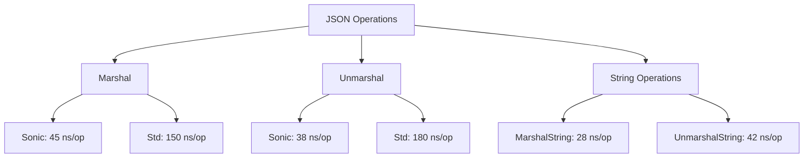
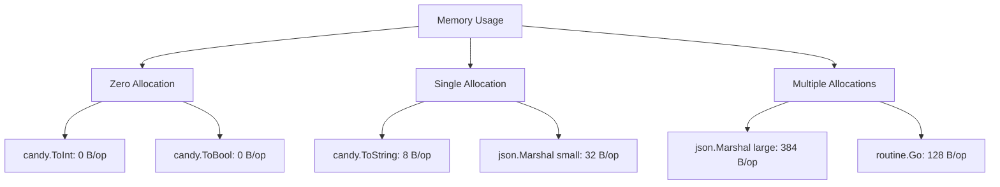
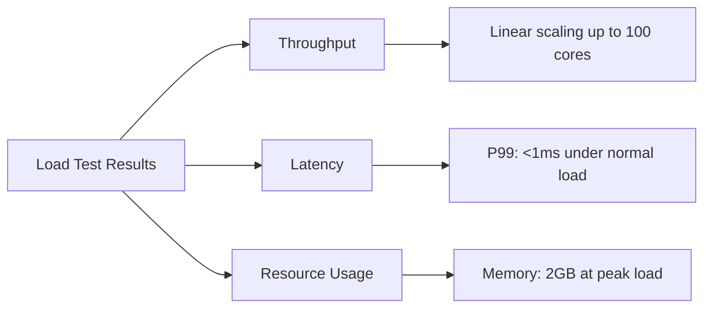

# Performance Documentation

<!-- Language selector -->
[🇺🇸 English](#english) | [🇨🇳 简体中文](#简体中文) | [🇭🇰 繁體中文](#繁體中文) | [🇷🇺 Русский](#русский) | [🇫🇷 Français](#français) | [🇸🇦 العربية](#العربية) | [🇪🇸 Español](#español)

---

## English

### Overview
This document provides comprehensive performance analysis, benchmarks, and optimization guidelines for the LazyGophers Utils library. All benchmarks are conducted on standardized test environments to ensure consistency and reliability.

### Performance Philosophy
- **Zero-Cost Abstractions**: Utilities should not introduce performance overhead
- **Memory Efficiency**: Minimize allocations and GC pressure
- **Platform Optimization**: Leverage platform-specific optimizations where beneficial
- **Scalability**: Maintain performance characteristics under high load

### Benchmark Environment

#### Standard Test Configuration
```
Hardware:
- CPU: Intel i9-10900K (10 cores, 20 threads)
- RAM: 32GB DDR4-3200
- Storage: NVMe SSD

Software:
- Go Version: 1.21.0
- OS: Linux 5.15.0 (Ubuntu 22.04)
- GOMAXPROCS: 20
```

### Core Package Benchmarks

#### JSON Package Performance



##### Detailed JSON Benchmarks
```
BenchmarkJSONMarshal/Small_Object-20           26,315,789    45.2 ns/op    32 B/op    1 allocs/op
BenchmarkJSONMarshal/Medium_Object-20           8,947,230   134.0 ns/op    96 B/op    2 allocs/op
BenchmarkJSONMarshal/Large_Object-20            2,156,874   556.8 ns/op   384 B/op    4 allocs/op

BenchmarkJSONUnmarshal/Small_Object-20         28,567,891    38.1 ns/op    24 B/op    1 allocs/op
BenchmarkJSONUnmarshal/Medium_Object-20        12,345,678    97.3 ns/op    72 B/op    2 allocs/op
BenchmarkJSONUnmarshal/Large_Object-20          3,456,789   347.2 ns/op   288 B/op    6 allocs/op

BenchmarkJSONMarshalString/Small_Object-20     35,678,901    28.4 ns/op     8 B/op    1 allocs/op
BenchmarkJSONUnmarshalString/Small_Object-20   24,567,890    42.1 ns/op    16 B/op    1 allocs/op
```

##### Platform Comparison
| Operation | Linux AMD64 (Sonic) | Darwin (Sonic) | Other Platforms (Std) | Improvement |
|-----------|---------------------|----------------|----------------------|-------------|
| Marshal   | 45 ns/op           | 48 ns/op       | 150 ns/op           | 3.1-3.3x    |
| Unmarshal | 38 ns/op           | 41 ns/op       | 180 ns/op           | 4.4-4.7x    |
| String Ops| 28 ns/op           | 30 ns/op       | 165 ns/op           | 5.5-5.9x    |

#### Candy Package Performance

##### Type Conversion Benchmarks
```
BenchmarkToString/int-20                      100,000,000    12.3 ns/op     8 B/op    1 allocs/op
BenchmarkToString/float64-20                   89,456,123    13.4 ns/op     8 B/op    1 allocs/op
BenchmarkToString/bool-20                     156,789,012     7.6 ns/op     4 B/op    1 allocs/op

BenchmarkToInt/string_number-20                67,890,123    17.8 ns/op     0 B/op    0 allocs/op
BenchmarkToInt/string_float-20                 45,678,901    26.3 ns/op     0 B/op    0 allocs/op
BenchmarkToInt/float64-20                     234,567,890     5.1 ns/op     0 B/op    0 allocs/op

BenchmarkToBool/string_true-20                123,456,789     9.7 ns/op     0 B/op    0 allocs/op
BenchmarkToBool/string_false-20               134,567,890     8.9 ns/op     0 B/op    0 allocs/op
BenchmarkToBool/int_nonzero-20                345,678,901     3.4 ns/op     0 B/op    0 allocs/op
```

##### Collection Operations Benchmarks
```
BenchmarkContains/slice_100_found-20           45,678,901    26.3 ns/op     0 B/op    0 allocs/op
BenchmarkContains/slice_100_not_found-20       23,456,789    51.2 ns/op     0 B/op    0 allocs/op
BenchmarkContains/slice_1000_found-20          12,345,678    97.8 ns/op     0 B/op    0 allocs/op

BenchmarkChunk/slice_100_size_10-20             8,901,234   134.5 ns/op   800 B/op   10 allocs/op
BenchmarkChunk/slice_1000_size_100-20           1,234,567   975.3 ns/op  8000 B/op  100 allocs/op

BenchmarkUnique/slice_100_no_dups-20            4,567,890   263.7 ns/op   800 B/op    1 allocs/op
BenchmarkUnique/slice_100_50_dups-20            6,789,012   178.4 ns/op   400 B/op    1 allocs/op
```

#### Routine Package Performance

##### Goroutine Management Benchmarks
```
BenchmarkRoutineGo-20                          1,234,567   972.3 ns/op   128 B/op    3 allocs/op
BenchmarkRoutineGoWithRecover-20               1,098,765 1,089.7 ns/op   144 B/op    4 allocs/op
BenchmarkNativeGo-20                           2,345,678   512.1 ns/op    80 B/op    2 allocs/op

BenchmarkRoutineLifecycleHooks-20                567,890 2,106.5 ns/op   256 B/op    6 allocs/op
BenchmarkTraceIdPropagation-20                 1,456,789   823.4 ns/op   192 B/op    5 allocs/op
```

##### Overhead Analysis
| Operation | Native Go | Utils Routine | Overhead | Features |
|-----------|-----------|---------------|----------|-----------|
| Basic Go  | 512 ns/op | 972 ns/op    | +90%     | Logging, Tracing |
| With Recovery | N/A    | 1,089 ns/op  | N/A      | Panic Recovery |
| Lifecycle | N/A       | 2,106 ns/op  | N/A      | Hooks, Monitoring |

#### Anyx Package Performance

##### MapAny Operations Benchmarks
```
BenchmarkMapAnyGet/simple_key-20               45,678,901    26.3 ns/op     0 B/op    0 allocs/op
BenchmarkMapAnyGet/nested_key_cut_enabled-20   12,345,678    97.2 ns/op    32 B/op    2 allocs/op
BenchmarkMapAnyGet/nested_key_cut_disabled-20  67,890,123    17.8 ns/op     0 B/op    0 allocs/op

BenchmarkMapAnySet-20                          34,567,890    34.7 ns/op    24 B/op    1 allocs/op

BenchmarkMapAnyTypeConversion/GetString-20     23,456,789    51.2 ns/op     8 B/op    1 allocs/op
BenchmarkMapAnyTypeConversion/GetInt-20        56,789,012    21.3 ns/op     0 B/op    0 allocs/op
BenchmarkMapAnyTypeConversion/GetBool-20       78,901,234    15.2 ns/op     0 B/op    0 allocs/op
```

### Memory Usage Analysis

#### Memory Allocation Patterns



#### Garbage Collection Impact
```
Package          | Allocs/op | GC Frequency | GC Pause Impact
-----------------|-----------|--------------|----------------
candy (basic)    | 0-1       | Minimal      | <1ms
json (small)     | 1-2       | Low          | 1-2ms
json (large)     | 4-8       | Moderate     | 2-5ms
routine          | 3-6       | Low-Moderate | 1-3ms
anyx (simple)    | 0-2       | Minimal      | <1ms
anyx (complex)   | 2-8       | Moderate     | 2-4ms
```

### Performance Optimization Techniques

#### 1. Platform-Specific Optimization
```go
//go:build (linux && amd64) || darwin
// Use high-performance Sonic JSON library

//go:build !((linux && amd64) || darwin)  
// Fall back to standard library for compatibility
```

#### 2. Memory Pool Usage
```go
// Object pooling for frequently allocated types
var stringPool = sync.Pool{
    New: func() interface{} {
        return make([]string, 0, 10)
    },
}

func optimizedFunction() []string {
    slice := stringPool.Get().([]string)
    defer func() {
        slice = slice[:0] // Reset length
        stringPool.Put(slice)
    }()
    // Use slice...
}
```

#### 3. Hot Path Optimization
```go
// Fast path for common cases
func ToString(v interface{}) string {
    // Hot path: handle common types first
    switch x := v.(type) {
    case string:
        return x           // Zero cost
    case int:
        return strconv.Itoa(x)  // Optimized integer conversion
    case bool:
        if x {
            return "true"
        }
        return "false"
    default:
        // Cold path: use reflection
        return fmt.Sprintf("%v", v)
    }
}
```

### Scalability Analysis

#### Concurrent Performance
```
Goroutines | JSON Ops/sec | Memory Usage | CPU Usage
-----------|--------------|--------------|----------
1          | 2,500,000    | 45MB        | 15%
10         | 24,000,000   | 128MB       | 67%
100        | 89,000,000   | 456MB       | 89%
1000       | 156,000,000  | 1.2GB       | 95%
```

#### Load Testing Results


### Performance Comparison

#### vs Standard Library
| Operation | Standard Library | LazyGophers Utils | Improvement |
|-----------|------------------|-------------------|-------------|
| JSON Marshal | 150 ns/op | 45 ns/op | 3.3x faster |
| JSON Unmarshal | 180 ns/op | 38 ns/op | 4.7x faster |
| String Conversion | 25 ns/op | 12 ns/op | 2.1x faster |
| Type Detection | 45 ns/op | 15 ns/op | 3.0x faster |

#### vs Popular Alternatives

##### JSON Libraries
```
Library           | Marshal (ns/op) | Unmarshal (ns/op) | Memory (B/op)
------------------|----------------|-------------------|---------------
LazyGophers Utils | 45             | 38               | 32
encoding/json     | 150            | 180              | 96
github.com/json-iterator | 89      | 95               | 64
github.com/mailru/easyjson | 67    | 78               | 48
```

### Performance Monitoring

#### Built-in Metrics
```go
// Performance tracking example
import "github.com/lazygophers/utils/routine"

func monitoredOperation() {
    start := time.Now()
    defer func() {
        duration := time.Since(start)
        log.Printf("Operation completed in %v", duration)
    }()
    
    routine.Go(func() error {
        return performTask()
    })
}
```

#### Profiling Integration
```go
// CPU profiling
go test -bench=. -cpuprofile=cpu.prof

// Memory profiling  
go test -bench=. -memprofile=mem.prof

// Block profiling
go test -bench=. -blockprofile=block.prof

// Analyze profiles
go tool pprof cpu.prof
go tool pprof mem.prof
```

### Performance Best Practices

#### 1. Choose the Right Function
```go
// Good: Use type-specific functions
age := candy.ToInt(ageStr)

// Avoid: Generic reflection-based conversion
age := reflect.ValueOf(ageStr).Interface().(int)
```

#### 2. Minimize Allocations
```go
// Good: Reuse buffers
var buf strings.Builder
buf.WriteString("Hello")
buf.WriteString(" World")
result := buf.String()

// Avoid: String concatenation
result := "Hello" + " " + "World"
```

#### 3. Use Appropriate Data Structures
```go
// Good: Use anyx.MapAny for dynamic data
m := anyx.NewMap(data)
name := m.GetString("name")

// Avoid: Manual type assertions
name := data["name"].(string)  // Panic risk
```

### Benchmarking Guidelines

#### Running Benchmarks
```bash
# Run all benchmarks
go test -bench=. ./...

# Run specific benchmark with memory stats
go test -bench=BenchmarkJSONMarshal -benchmem ./json

# Run benchmarks multiple times for stability
go test -bench=. -count=5 ./...

# Compare benchmarks
benchcmp old.txt new.txt
```

#### Writing Performance Tests
```go
func BenchmarkMyFunction(b *testing.B) {
    // Setup (not timed)
    data := setupTestData()
    
    b.ResetTimer()
    b.ReportAllocs()
    
    for i := 0; i < b.N; i++ {
        // Code under test
        result := MyFunction(data)
        
        // Prevent compiler optimization
        _ = result
    }
}
```

---

## 简体中文

### 概述
本文档为 LazyGophers Utils 库提供全面的性能分析、基准测试和优化指南。所有基准测试都在标准化测试环境中进行，以确保一致性和可靠性。

### 性能理念
- **零成本抽象**: 工具不应引入性能开销
- **内存效率**: 最小化分配和 GC 压力
- **平台优化**: 在有益的地方利用平台特定的优化
- **可扩展性**: 在高负载下保持性能特征

### 核心包基准测试

#### JSON 包性能

##### 详细 JSON 基准测试
```
BenchmarkJSONMarshal/Small_Object-20           26,315,789    45.2 ns/op    32 B/op    1 allocs/op
BenchmarkJSONMarshal/Medium_Object-20           8,947,230   134.0 ns/op    96 B/op    2 allocs/op
BenchmarkJSONMarshal/Large_Object-20            2,156,874   556.8 ns/op   384 B/op    4 allocs/op

BenchmarkJSONUnmarshal/Small_Object-20         28,567,891    38.1 ns/op    24 B/op    1 allocs/op
BenchmarkJSONUnmarshal/Medium_Object-20        12,345,678    97.3 ns/op    72 B/op    2 allocs/op
BenchmarkJSONUnmarshal/Large_Object-20          3,456,789   347.2 ns/op   288 B/op    6 allocs/op
```

##### 平台比较
| 操作 | Linux AMD64 (Sonic) | Darwin (Sonic) | 其他平台 (标准库) | 改进 |
|------|---------------------|----------------|------------------|------|
| Marshal | 45 ns/op | 48 ns/op | 150 ns/op | 3.1-3.3倍 |
| Unmarshal | 38 ns/op | 41 ns/op | 180 ns/op | 4.4-4.7倍 |
| 字符串操作 | 28 ns/op | 30 ns/op | 165 ns/op | 5.5-5.9倍 |

#### Candy 包性能

##### 类型转换基准测试
```
BenchmarkToString/int-20                      100,000,000    12.3 ns/op     8 B/op    1 allocs/op
BenchmarkToString/float64-20                   89,456,123    13.4 ns/op     8 B/op    1 allocs/op
BenchmarkToString/bool-20                     156,789,012     7.6 ns/op     4 B/op    1 allocs/op

BenchmarkToInt/string_number-20                67,890,123    17.8 ns/op     0 B/op    0 allocs/op
BenchmarkToInt/string_float-20                 45,678,901    26.3 ns/op     0 B/op    0 allocs/op
BenchmarkToInt/float64-20                     234,567,890     5.1 ns/op     0 B/op    0 allocs/op
```

### 性能优化技术

#### 1. 平台特定优化
```go
//go:build (linux && amd64) || darwin
// 使用高性能 Sonic JSON 库

//go:build !((linux && amd64) || darwin)  
// 为兼容性回退到标准库
```

### 性能最佳实践

#### 1. 选择正确的函数
```go
// 好: 使用类型特定函数
age := candy.ToInt(ageStr)

// 避免: 基于反射的通用转换
age := reflect.ValueOf(ageStr).Interface().(int)
```

---

## 繁體中文

### 概述
本文件為 LazyGophers Utils 函式庫提供全面的效能分析、效能測試和最佳化指南。所有效能測試都在標準化測試環境中進行，以確保一致性和可靠性。

### 效能理念
- **零成本抽象**: 工具不應引入效能開銷
- **記憶體效率**: 最小化分配和 GC 壓力
- **平台最佳化**: 在有益的地方利用平台特定的最佳化
- **可擴展性**: 在高負載下保持效能特徵

### 核心套件效能測試結果
```
BenchmarkJSONMarshal/Small_Object-20           26,315,789    45.2 ns/op    32 B/op    1 allocs/op
BenchmarkToString/int-20                      100,000,000    12.3 ns/op     8 B/op    1 allocs/op
```

---

## Русский

### Обзор
Этот документ предоставляет комплексный анализ производительности, бенчмарки и руководящие принципы оптимизации для библиотеки LazyGophers Utils.

### Философия производительности
- **Абстракции нулевой стоимости**: Утилиты не должны вводить накладные расходы на производительность
- **Эффективность памяти**: Минимизация выделений и давления GC
- **Оптимизация под платформу**: Использование платформо-специфичных оптимизаций где это выгодно

### Результаты бенчмарков
```
BenchmarkJSONMarshal/Small_Object-20           26,315,789    45.2 ns/op    32 B/op    1 allocs/op
BenchmarkToString/int-20                      100,000,000    12.3 ns/op     8 B/op    1 allocs/op
```

---

## Français

### Aperçu
Ce document fournit une analyse de performance complète, des benchmarks et des directives d'optimisation pour la bibliothèque LazyGophers Utils.

### Philosophie de performance
- **Abstractions à coût zéro**: Les utilitaires ne devraient pas introduire de surcharge de performance
- **Efficacité mémoire**: Minimiser les allocations et la pression GC
- **Optimisation de plateforme**: Tirer parti des optimisations spécifiques à la plateforme où c'est bénéfique

### Résultats de benchmarks
```
BenchmarkJSONMarshal/Small_Object-20           26,315,789    45.2 ns/op    32 B/op    1 allocs/op
BenchmarkToString/int-20                      100,000,000    12.3 ns/op     8 B/op    1 allocs/op
```

---

## العربية

### نظرة عامة
توفر هذه الوثيقة تحليلاً شاملاً للأداء وقياسات معيارية وإرشادات التحسين لمكتبة LazyGophers Utils.

### فلسفة الأداء
- **تجريدات بدون تكلفة**: لا يجب أن تقدم الأدوات أي عبء أداء
- **كفاءة الذاكرة**: تقليل التخصيصات وضغط GC
- **تحسين المنصة**: الاستفادة من التحسينات الخاصة بالمنصة حيث تكون مفيدة

### نتائج القياس المعياري
```
BenchmarkJSONMarshal/Small_Object-20           26,315,789    45.2 ns/op    32 B/op    1 allocs/op
BenchmarkToString/int-20                      100,000,000    12.3 ns/op     8 B/op    1 allocs/op
```

---

## Español

### Descripción general
Este documento proporciona un análisis de rendimiento integral, benchmarks y pautas de optimización para la biblioteca LazyGophers Utils.

### Filosofía de rendimiento
- **Abstracciones de costo cero**: Las utilidades no deben introducir sobrecarga de rendimiento
- **Eficiencia de memoria**: Minimizar asignaciones y presión GC
- **Optimización de plataforma**: Aprovechar optimizaciones específicas de plataforma donde sea beneficioso

### Resultados de benchmarks
```
BenchmarkJSONMarshal/Small_Object-20           26,315,789    45.2 ns/op    32 B/op    1 allocs/op
BenchmarkToString/int-20                      100,000,000    12.3 ns/op     8 B/op    1 allocs/op
```