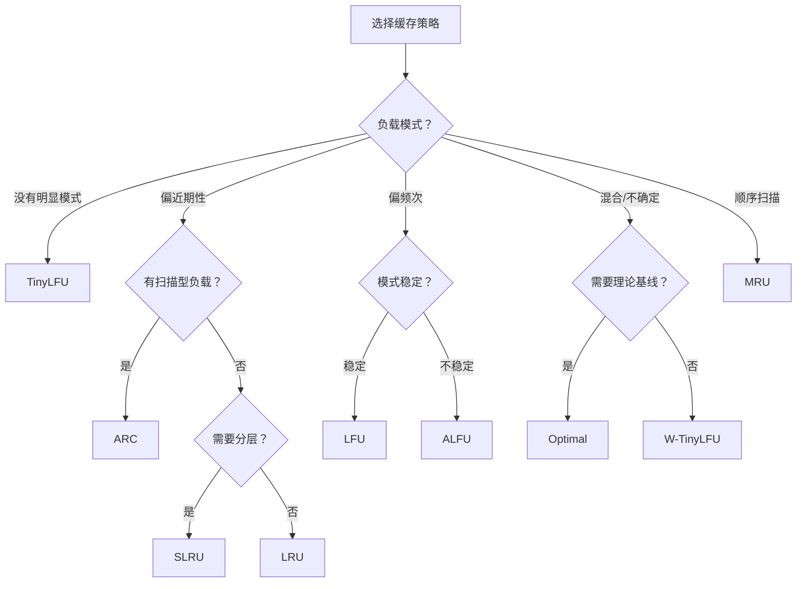

# 缓存策略

`cache` 主题不是一个统一实现，而是一组围绕不同访问模式设计的淘汰策略。选型前请先判断你的负载是更偏近期性、频次、扫描、还是混合模式。

## 共同语义

根据包级说明，这组缓存实现共享一套核心语义：

- `Get(key)`：读取值
- `Set(key, value)`：写入值
- `Has(key)`：判断是否存在
- `Del(key)`：删除值
- `Purge()`：清空缓存
- `Keys()`：列出 key
- `Len()`：返回当前长度

默认情况下，**不要先假设它们都是线程安全的**；某些实现会提供同步版本，但需要单独确认。

## 先怎么选

| 场景 | 建议先看 |
| --- | --- |
| 完全没有明显模式，想先从稳妥方案开始 | [TinyLFU](/modules/cache/tinylfu) |
| 通用、直觉型近期性缓存 | [LRU](/modules/cache/lru) |
| 更看重高频热点 | [LFU](/modules/cache/lfu) |
| 扫描与热点混合 | [ARC](/modules/cache/arc) |
| 需要理论基线做对比 | [Optimal](/modules/cache/optimal) |

## 什么时候不要直接拍脑袋选缓存

- 你还没确认读写比例。
- 你还没确认热点是否长期稳定。
- 你只依赖脱离负载上下文的宣传性指标做决策。

新版文档因此不再保留固定百分比结论；没有具体负载，数字通常没有解释力。
