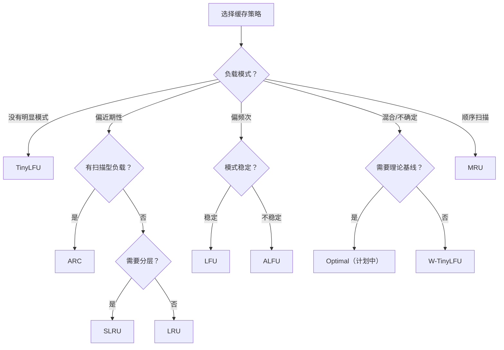

# 缓存策略

`cache` 不是一个统一实现，而是一组围绕不同访问模式设计的淘汰策略。选型前先判断你的负载偏近期性、频次、扫描还是混合模式。

## 共同接口

所有实现共享以下方法签名（定义在 `cache.Cache[K comparable, V any]` 接口中）：

| 方法 | 说明 |
| --- | --- |
| `Get(key K) (V, bool)` | 读取值，可能更新内部状态（近期性/频次） |
| `Put(key K, value V) bool` | 写入值，返回是否触发了淘汰 |
| `Remove(key K) (V, bool)` | 删除并返回被删除的值 |
| `Contains(key K) bool` | 判断是否存在，不更新内部状态 |
| `Peek(key K) (V, bool)` | 读取值但不更新内部状态 |
| `Len() int` | 当前条目数 |
| `Cap() int` | 容量上限 |
| `Clear()` | 清空所有条目 |
| `Keys() []K` | 所有 key（顺序由算法决定） |
| `Values() []V` | 所有 value |
| `Items() map[K]V` | 所有键值对 |
| `Resize(capacity int) error` | 调整容量，超出部分会被淘汰 |

所有实现都是**线程安全**的（内部使用 `sync.Mutex` 或 `sync.RWMutex`）。每个实现还提供 `NewWithEvict` 构造函数，接受淘汰回调 `(K, V)`。

## 先怎么选

| 场景 | 建议先看 |
| --- | --- |
| 不确定模式，想先从稳妥方案开始 | [W-TinyLFU](/modules/cache/wtinylfu) 或 [TinyLFU](/modules/cache/tinylfu) |
| 通用近期性缓存 | [LRU](/modules/cache/lru) |
| 频次敏感，访问模式稳定 | [LFU](/modules/cache/lfu) |
| 扫描与热点混合，模式会变 | [ARC](/modules/cache/arc) |
| 需要频次老化机制 | [ALFU](/modules/cache/alfu) |
| 顺序扫描为主 | [MRU](/modules/cache/mru) |

## 选型前确认

- 你是否知道读写比例？
- 热点是否长期稳定？
- 是否存在周期性扫描？

脱离具体负载谈命中率没有意义。如果不确定，W-TinyLFU 是最安全的起点。
