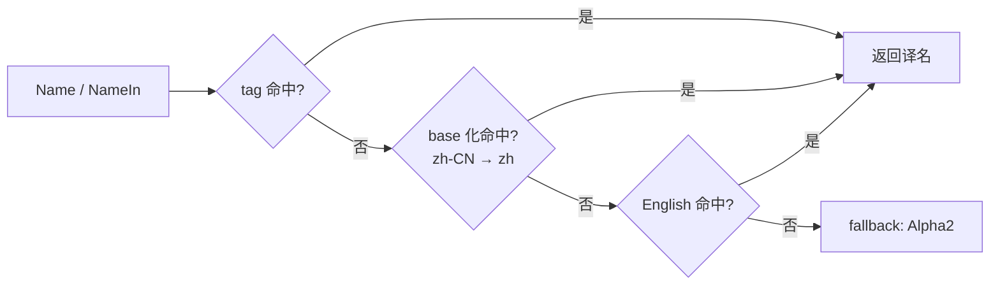

# country

`country` 包提供 **ISO 3166-1 国家/地区静态数据**：alpha-2/3/numeric 代码、多语言名（通用名 + 官方名）、IANA 主时区、ITU-T 拨号区号、ISO 4217 主货币、UN M.49 region/subregion、国旗 emoji。所有数据 hardcoded 在源码里，包 init 完成后只读，运行期 lookup 0 alloc。

提供 **双形态 API**：函数查表（`country.Get("CN")`）或强类型常量直访（`country.China`），两者返回同一指针。

## 适合什么场景

- 用户输入 alpha-2 / alpha-3 / numeric / 国名（任意语言），统一解析为同一 `*Country`。
- 渲染下拉框、用户区域选择器、表单字段：拿 `List()` + `Name()` 配合 `language.Set` 按用户语言显示。
- 根据手机号区号反查国家、根据国家推断时区/货币默认值。
- 强类型常量做编译期校验的白名单（如 `country.China` / `country.UnitedStates`），无需字符串字面量到处散。
- 离线场景：无外部数据源、无网络、无 embed 文件，单 binary 即可。

## 数据规格

| 维度 | 标准 | 字段 |
|---|---|---|
| 代码 | ISO 3166-1 | `Alpha2()` / `Alpha3()` / `Numeric()` |
| 名称 | 自维护多语言 map | `Name()` / `OfficialName()` |
| 区号 | ITU-T E.164 | `CallingCodes()`（带 `+` 前缀） |
| 时区 | IANA tzdata | `Timezones()`（主时区） |
| 货币 | ISO 4217 | `Currency()`（主货币） |
| 地理 | UN M.49 | `Continent()` / `Region()` / `Subregion()` |
| 视觉 | Unicode | `FlagEmoji()`（双 regional indicator） |

## 查询 API

```go
import "github.com/lazygophers/utils/country"

// 按代码查（大小写不敏感）
cn := country.Get("CN")            // Alpha2
cn = country.Get("cn")              // 同一指针
cn = country.GetByAlpha3("CHN")    // Alpha3
cn = country.GetByNumeric(156)     // Numeric

// 按名查（任意已注册语言的通用名/官方名，小写匹配）
cn = country.GetByName("中国")
cn = country.GetByName("China")

// 全量列表（按 Alpha2 排序，切片副本可放心改）
all := country.List()

// 强类型常量直访（与 Get 返回同一指针）
_ = country.China == country.Get("CN") // true
_ = country.UnitedStates
```

未命中返回 `nil`；调用方自行判 nil。

## Country 方法

| 方法 | 返回 | 说明 |
|---|---|---|
| `Alpha2()` | `string` | ISO 3166-1 alpha-2，如 `"CN"` |
| `Alpha3()` | `string` | ISO 3166-1 alpha-3，如 `"CHN"` |
| `Numeric()` | `int` | ISO 3166-1 numeric，如 `156` |
| `Name()` | `string` | 通用名，按当前 goroutine 语言 |
| `NameIn(tag)` | `string` | 显式语言（`xlanguage.Tag`） |
| `OfficialName()` | `string` | 官方名，按当前 goroutine 语言 |
| `OfficialNameIn(tag)` | `string` | 显式语言官方名 |
| `CallingCodes()` | `[]string` | 拨号区号副本，含 `+` |
| `Timezones()` | `[]string` | IANA 主时区副本 |
| `Currency()` | `*currency.Currency` | 主货币（来自 [currency](/modules/data/currency) 包） |
| `Capital()` | `string` | 首都，按当前 goroutine 语言 |
| `CapitalIn(tag)` | `string` | 显式语言首都 |
| `Tlds()` | `[]string` | ccTLD 副本，如 `[".cn"]` |
| `Languages()` | `[]xlanguage.Tag` | 官方语言 stdlib tag 列表副本 |
| `Continent()` | `string` | `"AS"/"EU"/"AF"/"NA"/"SA"/"OC"/"AN"` |
| `Region()` | `string` | UN M.49 region，如 `"Asia"` |
| `Subregion()` | `string` | UN M.49 sub-region，如 `"Eastern Asia"` |
| `FlagEmoji()` | `string` | 国旗 emoji |
| `String()` | `string` | 同 `Alpha2()`，满足 `fmt.Stringer` |

`CallingCodes()` / `Timezones()` 返回切片**副本**，外部修改不会污染包内状态。

## Currency

`Country.Currency()` 返回 `*currency.Currency`，由独立的 [currency](/modules/data/currency) 包提供。多个国家可共享同一货币指针（如欧元区）。

## 多语言



- 公共 API 中所有 tag 参数都用 stdlib `golang.org/x/text/language.Tag`（值类型）。
- `Name()`（无参版本）从 `language.Get()` 取 goroutine-local 语言，未设置时回退 `English`。
- **1 国 1 数据文件**：`country/<alpha2>.go`（如 `cn.go` / `jp.go`）。
- **每语言独立 locale**：`country/<alpha2>_<lang>.go`（如 `cn_zh.go` / `jp_en.go`）。
- **默认编译 en/zh**：`<alpha2>_en.go` / `<alpha2>_zh.go` 无 build tag，始终激活。
- **官方语言豁免**：该国 `languages` 含某语言时，对应 `<alpha2>_<lang>.go` 也无 build tag。例如 `jp_ja.go`、`kr_ko.go`、`hk_zh_hant.go` 默认激活。
- **扩展语言走 build tag**：`go build -tags lang_ja`（单语言）或 `-tags lang_all`（全开）。支持的扩展：`zh-Hant` / `ja` / `ko` / `es` / `fr` / `ru` / `ar`。
- 未注册语言走「tag → base → English → Alpha2」回退链；`OfficialName` 多一层「英文通用名」兜底。

## 使用示例

### 基础查询

```go
package main

import (
    "fmt"

    "github.com/lazygophers/utils/country"
)

func main() {
    cn := country.Get("CN")
    fmt.Println(cn.Alpha2(), cn.Alpha3(), cn.Numeric()) // CN CHN 156
    fmt.Println(cn.CallingCodes())                      // [+86]
    fmt.Println(cn.Timezones())                         // [Asia/Shanghai]
    fmt.Println(cn.Currency().Code(), cn.Currency().Symbol()) // CNY ¥
    fmt.Println(cn.FlagEmoji())                         // 🇨🇳
}
```

### 强类型常量

```go
import "github.com/lazygophers/utils/country"

var defaultCountry = country.China // *Country，编译期校验，无字符串字面量散播
```

### 按 goroutine 切换语言

```go
import (
    "fmt"

    xlanguage "golang.org/x/text/language"

    "github.com/lazygophers/utils/country"
    "github.com/lazygophers/utils/language"
)

func render() {
    language.Set(language.Make("zh"))
    fmt.Println(country.China.Name())         // 中国
    fmt.Println(country.China.OfficialName()) // 中华人民共和国

    language.Set(language.Make("en"))
    fmt.Println(country.China.Name())         // China

    // 显式 tag，不依赖 goroutine-local
    fmt.Println(country.China.NameIn(xlanguage.Japanese)) // 中国（需 lang_ja 编译）
}
```

### 配合 HTTP Accept-Language

```go
import (
    "net/http"

    xlanguage "golang.org/x/text/language"

    "github.com/lazygophers/utils/country"
    "github.com/lazygophers/utils/language"
)

func handler(w http.ResponseWriter, r *http.Request) {
    tag, _, _ := xlanguage.ParseAcceptLanguage(r.Header.Get("Accept-Language"))
    if len(tag) > 0 {
        language.Set(language.NewTag(tag[0]))
    }
    for _, c := range country.List() {
        // c.Name() 自动按当前请求语言渲染
        _ = c.Name()
    }
}
```

## 约束

- 数据 hardcoded 在 `.go` 源码（每国 1 文件 `country/<alpha2>.go`），无 `embed.FS` / JSON / YAML 资源。
- 注册时机：包 `init()`；运行时索引只读，`Get*` 无锁、0 alloc。
- 切片字段返回**副本**，外部 mutate 不污染包内状态。
- 不依赖 `i18n` / `xerror` / `context.Context`，最小耦合。
- 多货币国仅记录主货币；ISO 3166-2（subdivision）不在 scope。
- 公共 API 语言参数严格用 stdlib `golang.org/x/text/language.Tag`。

## 相关文档

- [currency](/modules/data/currency) — 独立的 ISO 4217 货币包
- [language](/modules/core/language)
- [i18n](/modules/core/i18n)
