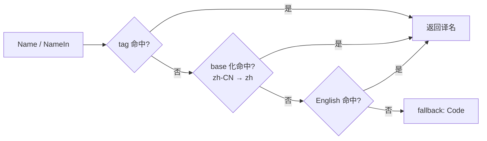

# currency

`currency` 包提供 **ISO 4217 货币数据**：字母码 / 符号 / 数字码 + 多语言名称（en/zh 默认 + 7 扩展语言 build tag）。154 种货币常量直访，单 binary 离线可用。

## 适合什么场景

- 国际化收银/账单/价格渲染：按用户语言展示货币名（人民币 / Yuan Renminbi / 元）。
- 用户输入货币 code（"CNY"/"cny"），统一解析为 `*currency.Currency`。
- 强类型常量代替字符串字面量：`currency.Cny` / `currency.Usd` / `currency.Eur`，编译期校验。
- 与 [country](/modules/data/country) 联动：`country.China.Currency() == currency.Cny`。

## 类型规格

| 维度 | 标准 | 字段 |
|---|---|---|
| 字母码 | ISO 4217 | `Code()`，如 `"CNY"` |
| 符号 | 约定 | `Symbol()`，如 `"¥"` |
| 数字码 | ISO 4217 | `Numeric()`，如 `156` |
| 名称 | 自维护多语言 | `Name()` / `NameIn(tag)` |

## 查询 API

```go
import "github.com/lazygophers/utils/currency"

// 按字母码（大小写不敏感）
cny := currency.Get("CNY")
cny = currency.Get("cny")             // 同一指针

// 按数字码
cny = currency.GetByNumeric(156)

// 全量列表（副本）
all := currency.List()                // []*Currency

// 强类型常量直访
_ = currency.Cny == currency.Get("CNY") // true
_ = currency.Usd
_ = currency.Eur
```

未命中返回 `nil`。

## Currency 方法

| 方法 | 返回 | 说明 |
|---|---|---|
| `Code()` | `string` | ISO 4217 字母码 |
| `Symbol()` | `string` | 货币符号 |
| `Numeric()` | `int` | ISO 4217 数字码 |
| `Name()` | `string` | 货币名，按当前 goroutine 语言 |
| `NameIn(tag)` | `string` | 显式 `xlanguage.Tag` |
| `RegisterName(tag, name)` | — | 注册译名（locale 文件 init 用） |
| `String()` | `string` | 同 `Code()`，满足 `fmt.Stringer` |

## 多语言



- 公共 API tag 用 stdlib `golang.org/x/text/language.Tag`。
- **1 币 1 数据文件** `currency/<code>.go`（如 `cny.go`）：`var Cny = New("CNY", "¥", 156)`。
- **每语言独立 locale**：`currency/<code>_<lang>.go`。
- **默认编译 en/zh**：`<code>_en.go` / `<code>_zh.go` 无 build tag。
- **扩展语言走 build tag**：`zh-Hant` / `ja` / `ko` / `es` / `fr` / `ru` / `ar`，每个 `//go:build lang_<xx> || lang_all`。
- 货币无「官方语言豁免」（区别于 country 包）。

## 使用示例

### 基础查询

```go
import (
    "fmt"

    "github.com/lazygophers/utils/currency"
)

func main() {
    cny := currency.Get("CNY")
    fmt.Println(cny.Code(), cny.Symbol(), cny.Numeric()) // CNY ¥ 156
    fmt.Println(cny.Name())                              // Yuan Renminbi（默认 en）
}
```

### 强类型常量

```go
import "github.com/lazygophers/utils/currency"

var defaultCcy = currency.Cny       // *Currency，编译期校验
```

### 按 goroutine 切换语言

```go
import (
    "fmt"

    "github.com/lazygophers/utils/currency"
    "github.com/lazygophers/utils/language"
)

func render() {
    language.Set(language.Make("zh"))
    fmt.Println(currency.Cny.Name())   // 人民币

    language.Set(language.Make("en"))
    fmt.Println(currency.Cny.Name())   // Yuan Renminbi
}
```

### 与 country 联动

```go
import (
    "github.com/lazygophers/utils/country"
    "github.com/lazygophers/utils/currency"
)

func main() {
    _ = country.China.Currency() == currency.Cny // true
}
```

## 约束

- 数据 hardcoded `.go` 源码（每币 1 文件），无 embed/JSON/YAML。
- 运行时索引只读，`Get`/`GetByNumeric` 0 alloc。
- 切片返回副本。
- 不依赖 `i18n` / `xerror` / `context.Context`。
- 公共 API tag 严格 stdlib `xlanguage.Tag`。

## 相关文档

- [country](/modules/data/country)
- [language](/modules/core/language)
- [i18n](/modules/core/i18n)
