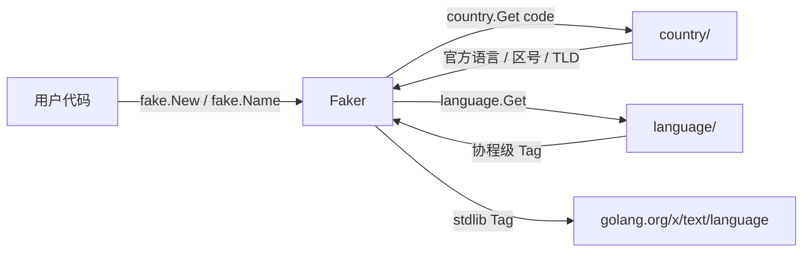

# fake

`fake` 提供**按国家维度的假数据生成**：姓名、身份证号、电话、地址、邮箱、UUID、Lorem 文本、随机时间数值等。强耦合 [`country`](../system/) 与 [`language`](../system/)，与 [`randx`](./randx) 形成"底层随机 vs 业务假数据"的清晰分工。

## 适合什么场景

- **单元测试 / 集成测试 fixture**：快速造出合法的姓名 / 身份证 / 电话，省掉手写常量。
- **Demo / 样例数据**：UI 预览、文档示例、前端 mock。
- **压测数据生成**：seedable 可复现，方便回放。
- **本地开发数据库填充**：249 国数据骨架，按需扩展国家。

## 与 randx 的区别

| 维度 | randx | fake |
| --- | --- | --- |
| 抽象层级 | 底层随机源（int / float / bool / 字节） | 业务实体（人名 / 地址 / 证件号） |
| 国家/语言感知 | 否 | 是（按 `country.Code` 分发，复用 `language` 协程级语言） |
| 复现性 | 进程级全局 | 实例级 seed，`WithSeed(42)` 可完全复现 |
| 典型调用方 | 数据处理 / 算法 / 抽样 | 测试 / Demo / Mock |

需要原子随机走 randx；需要"造个像样的中国用户"走 fake。

## 核心特性

- **249 国骨架**：每个 ISO 3166-1 国家都有数据文件占位；CN / US / JP 已填齐真数据，其他国家走 fallback chain → 官方语言池 → en 兜底。
- **locale 感知**：基于 `country.OfficialLanguages` 自动选语种，无需手动传 lang。
- **可复现**：`fake.WithSeed(int64)` 内部走 `math/rand/v2` PCG，同 seed 序列完全一致。
- **双形态 API**：显式实例 `fake.New(country.China)` 或全局 `fake.Name()`（按 goroutine-local 语言推断国家）。
- **零分配热路径**：`Name()` ≤ 200 ns/op、UUIDv4 ≤ 100 ns/op。

## 快速上手

```go
import (
    "fmt"
    "github.com/lazygophers/utils/country"
    "github.com/lazygophers/utils/fake"
)

f := fake.New(country.China)
fmt.Println(f.Name())     // 张伟
fmt.Println(f.Phone())    // +86 138-xxxx-xxxx
fmt.Println(f.IdCard())   // 18 位身份证 + 校验码合法
fmt.Println(f.Email())    // alice.smith@gmail.com
fmt.Println(f.FullAddress())
```

## 全局函数 vs 实例

```go
// 全局：按 language.Get() 推断当前国家
fake.Name()                              // 默认 en → 英文姓名
language.Set(language.Chinese)
fake.Name()                              // → 中文姓名

// 一次性切国家（链式）
fake.WithCountry(country.Japan).Name()   // 日文姓名

// 显式实例（推荐：测试可控）
f := fake.New(country.Japan)
f.Name()
```

全局函数底层走 `sync.Map` 池缓存每国默认 Faker，避免重复建实例。

## 可复现性（WithSeed）

```go
a := fake.New(country.China, fake.WithSeed(42))
b := fake.New(country.China, fake.WithSeed(42))
// 同 seed 下，a 与 b 调用任意 API 输出序列完全一致
a.Name() == b.Name()   // true
a.IdCard() == b.IdCard() // true
```

带 seed 实例自带 Mutex 保证并发安全；默认全局实例走 `math/rand/v2` 全局源（已线程安全）。

## API 速查

| 分组 | 函数 |
| --- | --- |
| 姓名身份 | `Name` / `FirstName` / `LastName` / `Username` / `Gender` |
| 证件生日 | `IdCard` / `PassportNo` / `Birthday` |
| 联系方式 | `Email` / `Phone` / `Tel` / `CallingCode` |
| 地理地址 | `Province` / `City` / `District` / `Street` / `ZipCode` / `Latitude` / `Longitude` / `FullAddress` |
| 网络识别符 | `UUIDv4` / `UUIDv7` / `IPv4` / `IPv6` / `Mac` / `Md5Hex` / `Sha1Hex` / `Sha256Hex` / `Domain` / `UserAgent` / `Url` |
| 文本 | `Word` / `Sentence` / `Paragraph` / `ChineseWord` / `ChineseSentence` / `ChineseParagraph` |
| 时间数值 | `Date` / `Time` / `IntRange` / `Int64Range` / `Float64Range` / `Bool` / `Pick[T]` / `Sample[T]` / `Shuffle[T]` |
| 颜色文件 | `HexColor` / `RgbColor` / `HslColor` / `FileName` / `FileExt` / `MimeType` |

## 与 country / language 的集成关系



- `country` 提供静态元数据（官方语言、电话区号、TLD），fake 不重复定义。
- `language` 提供 goroutine-local Tag，全局函数据此推断默认国家（zh→CN、en→US、ja→JP）。
- 公共 API 暴露 `language.Tag`（stdlib），不暴露 `utils/language` 内部类型。

## 国家覆盖

| 国家 | 状态 | 说明 |
| --- | --- | --- |
| CN（中国） | 真数据 | 百家姓 + 男女名各 200+、34 省 + 主要城市 300+、身份证 GB 11643 校验 |
| US（美国） | 真数据 | first/last 各 500+、50 州首府 + 主要城市、SSN `xxx-xx-xxxx` |
| JP（日本） | 真数据（lang_ja 或 lang_all build） | 漢字 + ひらがな 姓名、47 都道府县、My Number |
| 其他 246 国 | 骨架占位 | 电话区号 / TLD 来自 country 包；姓名/地名 fallback 到官方语言池或 en 兜底 |

新国家可通过 PR 增量补全：`fake/data/<code>.go` 数据骨架 + `fake/data/<code>_<lang>.go` 语种数据，build tag 规则与 country/currency 对齐。

## 注意事项

- **不是 crypto-safe 随机源**。安全敏感场景（token / 密钥 / nonce）请用 `crypto/rand` 或 [`cryptox`](../network/cryptox)。
- `IdCard` / `Ssn` / `My Number` 只满足**格式与校验位合规**，不对应任何真实自然人；勿用于身份验证。
- 246 国骨架数据待社区逐步补全；当前 fallback 不保证文化贴合。
- 默认全局实例共享 `math/rand/v2` 全局源；若需严格可复现请用 `New(country, WithSeed(...))`。

## 相关文档

- [randx](./randx) — 底层随机源
- [defaults](./defaults) — 结构体默认值
- [country 模块](../system/) — 国家元数据
