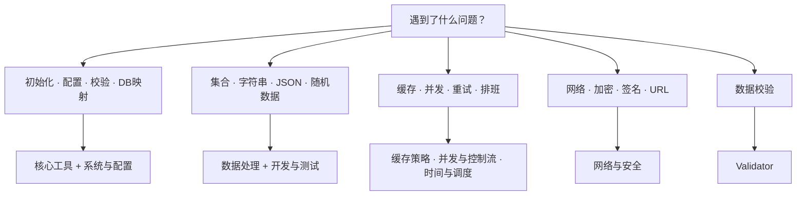

# 模块总览

LazyGophers Utils 的包很多，但它们并不是一团散乱的工具集合。更容易理解的方式，是按工程问题来读，而不是按目录名去猜。

## 八个主题分组

| 分组 | 什么时候先看它 | 模块 |
| --- | --- | --- |
| [核心工具](/modules/core/) | 想减少初始化样板代码，或处理数据库字段映射 | [must](/modules/core/must)、[orm](/modules/core/orm) |
| [数据处理](/modules/data/) | 想做类型转换、集合操作、字符串规范化、JSON 编解码 | [candy](/modules/data/candy)、[json](/modules/data/json)、[stringx](/modules/data/stringx)、[anyx](/modules/data/anyx) |
| [缓存策略](/modules/cache/) | 想在多种淘汰策略里选一个更适合实际负载的缓存 | [缓存概览](/modules/cache/)、[LRU](/modules/cache/lru)、[LFU](/modules/cache/lfu)、[TinyLFU](/modules/cache/tinylfu)、[SLRU](/modules/cache/slru)、[MRU](/modules/cache/mru)、[ALFU](/modules/cache/alfu)、[ARC](/modules/cache/arc)、[LRU-K](/modules/cache/lruk)、[W-TinyLFU](/modules/cache/wtinylfu)、[FBR](/modules/cache/fbr)、[Optimal](/modules/cache/optimal) |
| [时间与调度](/modules/time/) | 想处理农历、节气、日历或固定排班规则 | [xtime](/modules/time/xtime)、[xtime996](/modules/time/xtime996)、[xtime955](/modules/time/xtime955)、[xtime007](/modules/time/xtime007) |
| [系统与配置](/modules/system/) | 想做配置加载、路径定位、应用初始化与退出清理 | [config](/modules/system/config)、[runtime](/modules/system/runtime)、[osx](/modules/system/osx)、[app](/modules/system/app)、[atexit](/modules/system/atexit) |
| [网络与安全](/modules/network/) | 想处理网络辅助、加密、签名或 URL 规范化 | [network](/modules/network/network)、[cryptox](/modules/network/cryptox)、[pgp](/modules/network/pgp)、[urlx](/modules/network/urlx) |
| [并发与控制流](/modules/concurrency/) | 想组织任务执行、等待条件、熔断或去重 | [routine](/modules/concurrency/routine)、[wait](/modules/concurrency/wait)、[hystrix](/modules/concurrency/hystrix)、[singledo](/modules/concurrency/singledo)、[event](/modules/concurrency/event) |
| [开发与测试](/modules/dev/) | 想补默认值、制造随机/假数据或接入采样工具 | [randx](/modules/dev/randx)、[defaults](/modules/dev/defaults)、[pyroscope](/modules/dev/pyroscope) |

## 独立模块

| 模块 | 说明 |
| --- | --- |
| [Validator](/validator/) | 数据校验——169 个内置验证器，100% 覆盖 go-playground/validator v10 全部规则 |

## 选择顺序建议

### 先判断是"基础设施问题"还是"业务辅助问题"

- 如果你在做启动、配置、校验、数据库字段映射：先看 **核心工具** 与 **系统与配置**。
- 如果你在做集合处理、字符串规整、JSON、随机数据：先看 **数据处理** 与 **开发与测试**。
- 如果你在做缓存、并发、重试、定时规则：先看 **缓存策略**、**并发与控制流**、**时间与调度**。

### 再判断是否存在局部规则

以下主题在选型前最好先读页面说明，而不是直接猜 API：

- **缓存**：每种策略的淘汰逻辑不同，默认线程安全语义也要单独看。
- **xtime**：不仅有时间帮助函数，还包含农历、节气与排班规则。
- **atexit**：不同平台退出行为并不完全一样。

## 推荐阅读路径

1. 新项目接入：`must` → `config` → `validator` → 对应业务主题模块。
2. 已有项目补能力：从对应分类页进入，再看单模块页的适用场景。
3. 需要精确签名：模块页读完后转到 [pkg.go.dev](https://pkg.go.dev/github.com/lazygophers/utils)。
