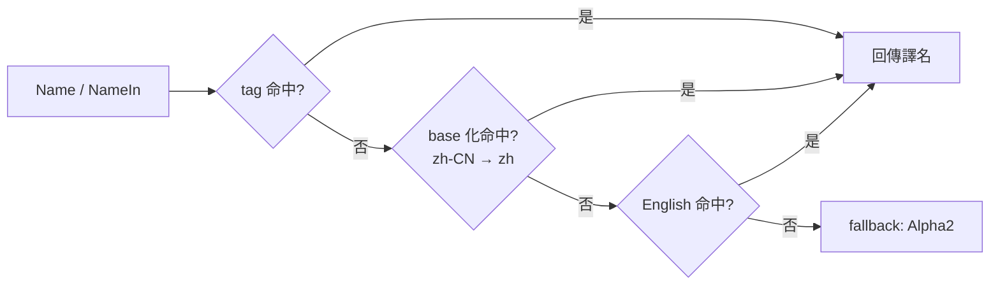

# country

`country` 套件提供 **ISO 3166-1 國家/地區靜態數據**：alpha-2/3/numeric 代碼、多語言名（通用名 + 官方名）、IANA 主時區、ITU-T 撥號區號、ISO 4217 主貨幣、UN M.49 region/subregion、國旗 emoji。所有數據 hardcoded 在原始碼裡，套件 init 完成後唯讀，執行期 lookup 0 alloc。

提供 **雙形態 API**：函數查表（`country.Get("CN")`）或強型別常數直存（`country.China`），兩者回傳同一指標。

## 適合什麼場景

- 使用者輸入 alpha-2 / alpha-3 / numeric / 國名（任意語言），統一解析為同一 `*Country`。
- 渲染下拉選單、使用者區域選擇器、表單欄位：拿 `List()` + `Name()` 搭配 `language.Set` 按使用者語言顯示。
- 依手機號區號反查國家、依國家推斷時區/貨幣預設值。
- 強型別常數做編譯期檢核的白名單（如 `country.China` / `country.UnitedStates`），不用字串字面量到處散落。
- 離線場景：無外部資料源、無網路、無 embed 檔案，單一 binary 即可。

## 數據規格

| 維度 | 標準 | 欄位 |
|---|---|---|
| 代碼 | ISO 3166-1 | `Alpha2()` / `Alpha3()` / `Numeric()` |
| 名稱 | 自維護多語言 map | `Name()` / `OfficialName()` |
| 區號 | ITU-T E.164 | `CallingCodes()`（帶 `+` 前綴） |
| 時區 | IANA tzdata | `Timezones()`（主時區） |
| 貨幣 | ISO 4217 | `Currency()`（主貨幣） |
| 地理 | UN M.49 | `Continent()` / `Region()` / `Subregion()` |
| 視覺 | Unicode | `FlagEmoji()`（雙 regional indicator） |

## 查詢 API

```go
import "github.com/lazygophers/utils/country"

// 依代碼查（大小寫不敏感）
cn := country.Get("CN")            // Alpha2
cn = country.Get("cn")              // 同一指標
cn = country.GetByAlpha3("CHN")    // Alpha3
cn = country.GetByNumeric(156)     // Numeric

// 依名稱查（任意已註冊語言的通用名/官方名，小寫匹配）
cn = country.GetByName("中国")
cn = country.GetByName("China")

// 全量列表（按 Alpha2 排序，切片副本可放心改）
all := country.List()

// 強型別常數直存（與 Get 回傳同一指標）
_ = country.China == country.Get("CN") // true
_ = country.UnitedStates
```

未命中回傳 `nil`；呼叫方自行判 nil。

## Country 方法

| 方法 | 回傳 | 說明 |
|---|---|---|
| `Alpha2()` | `string` | ISO 3166-1 alpha-2，如 `"CN"` |
| `Alpha3()` | `string` | ISO 3166-1 alpha-3，如 `"CHN"` |
| `Numeric()` | `int` | ISO 3166-1 numeric，如 `156` |
| `Name()` | `string` | 通用名，按當前 goroutine 語言 |
| `NameIn(tag)` | `string` | 顯式語言（`xlanguage.Tag`） |
| `OfficialName()` | `string` | 官方名，按當前 goroutine 語言 |
| `OfficialNameIn(tag)` | `string` | 顯式語言官方名 |
| `CallingCodes()` | `[]string` | 撥號區號副本，含 `+` |
| `Timezones()` | `[]string` | IANA 主時區副本 |
| `Currency()` | `*currency.Currency` | 主貨幣（來自 [currency](/zh-TW/modules/data/currency) 包） |
| `Capital()` | `string` | 首都，按當前 goroutine 語言 |
| `CapitalIn(tag)` | `string` | 顯式語言首都 |
| `Tlds()` | `[]string` | ccTLD 副本 |
| `Languages()` | `[]xlanguage.Tag` | 官方語言 stdlib tag 列表副本 |
| `Continent()` | `string` | `"AS"/"EU"/"AF"/"NA"/"SA"/"OC"/"AN"` |
| `Region()` | `string` | UN M.49 region，如 `"Asia"` |
| `Subregion()` | `string` | UN M.49 sub-region，如 `"Eastern Asia"` |
| `FlagEmoji()` | `string` | 國旗 emoji |
| `String()` | `string` | 同 `Alpha2()`，滿足 `fmt.Stringer` |

`CallingCodes()` / `Timezones()` 回傳切片**副本**，外部修改不會污染套件內狀態。

## Currency

`Country.Currency()` 回傳 `*currency.Currency`，由獨立的 [currency](/zh-TW/modules/data/currency) 套件提供。多個國家可共用同一貨幣指標（如歐元區）。

## 多語言



- 公開 API 中所有 tag 參數都用 stdlib `golang.org/x/text/language.Tag`（值型別）。
- `Name()`（無參版本）從 `language.Get()` 取 goroutine-local 語言，未設定時回退 `English`。
- **1 國 1 資料檔**：`country/<alpha2>.go`（如 `cn.go` / `jp.go`）。
- **每語言獨立 locale**：`country/<alpha2>_<lang>.go`。
- **預設編譯 en/zh**：`<alpha2>_en.go` / `<alpha2>_zh.go` 無 build tag，始終啟用。
- **官方語言豁免**：該國 `languages` 含某語言時，對應 `<alpha2>_<lang>.go` 也無 build tag。例如 `jp_ja.go` / `kr_ko.go` / `hk_zh_hant.go` 預設啟用。
- **擴充語言走 build tag**：`go build -tags lang_ja`（單一語言）或 `-tags lang_all`（全開）。支援的擴充：`zh-Hant` / `ja` / `ko` / `es` / `fr` / `ru` / `ar`。
- 未註冊語言走「tag → base → English → Alpha2」回退鏈；`OfficialName` 多一層「英文通用名」兜底。

## 使用範例

### 基礎查詢

```go
package main

import (
    "fmt"

    "github.com/lazygophers/utils/country"
)

func main() {
    cn := country.Get("CN")
    fmt.Println(cn.Alpha2(), cn.Alpha3(), cn.Numeric()) // CN CHN 156
    fmt.Println(cn.CallingCodes())                      // [+86]
    fmt.Println(cn.Timezones())                         // [Asia/Shanghai]
    fmt.Println(cn.Currency().Code(), cn.Currency().Symbol()) // CNY ¥
    fmt.Println(cn.FlagEmoji())                         // 🇨🇳
}
```

### 強型別常數

```go
import "github.com/lazygophers/utils/country"

var defaultCountry = country.China // *Country，編譯期檢核，無字串字面量散播
```

### 按 goroutine 切換語言

```go
import (
    "fmt"

    xlanguage "golang.org/x/text/language"

    "github.com/lazygophers/utils/country"
    "github.com/lazygophers/utils/language"
)

func render() {
    language.Set(language.Make("zh"))
    fmt.Println(country.China.Name())         // 中国
    fmt.Println(country.China.OfficialName()) // 中华人民共和国

    language.Set(language.Make("en"))
    fmt.Println(country.China.Name())         // China

    // 顯式 tag，不依賴 goroutine-local
    fmt.Println(country.China.NameIn(xlanguage.Japanese)) // 中国（需 lang_ja 編譯）
}
```

### 搭配 HTTP Accept-Language

```go
import (
    "net/http"

    xlanguage "golang.org/x/text/language"

    "github.com/lazygophers/utils/country"
    "github.com/lazygophers/utils/language"
)

func handler(w http.ResponseWriter, r *http.Request) {
    tag, _, _ := xlanguage.ParseAcceptLanguage(r.Header.Get("Accept-Language"))
    if len(tag) > 0 {
        language.Set(language.NewTag(tag[0]))
    }
    for _, c := range country.List() {
        // c.Name() 自動按當前請求語言渲染
        _ = c.Name()
    }
}
```

## 約束

- 數據 hardcoded 在 `.go` 原始碼（每國 1 檔 `country/<alpha2>.go`），無 `embed.FS` / JSON / YAML 資源。
- 註冊時機：套件 `init()`；執行期索引唯讀，`Get*` 無鎖、0 alloc。
- 切片欄位回傳**副本**，外部 mutate 不污染套件內狀態。
- 不依賴 `i18n` / `xerror` / `context.Context`，最小耦合。
- 多貨幣國僅記錄主貨幣；ISO 3166-2（subdivision）不在 scope。
- 公開 API 語言參數嚴格用 stdlib `golang.org/x/text/language.Tag`。

## 相關文檔

- [currency](/zh-TW/modules/data/currency) — 獨立的 ISO 4217 貨幣套件
- [language](/zh-TW/modules/core/language)
- [i18n](/zh-TW/modules/core/i18n)
