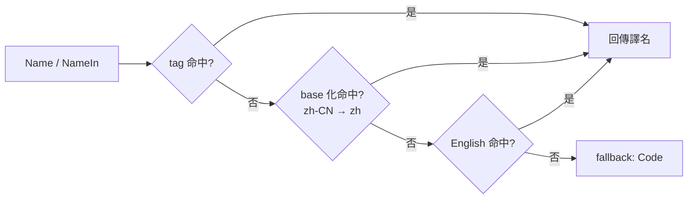

# currency

`currency` 套件提供 **ISO 4217 貨幣數據**：字母碼 / 符號 / 數字碼 + 多語言名稱（en/zh 預設 + 7 擴充語言 build tag）。154 種貨幣常數直訪，單 binary 離線可用。

## 適合什麼場景

- 國際化收銀/帳單/價格渲染：按使用者語言展示貨幣名（人民幣 / Yuan Renminbi / 元）。
- 使用者輸入貨幣 code（"CNY"/"cny"），統一解析為 `*currency.Currency`。
- 強型別常數代替字串字面量：`currency.Cny` / `currency.Usd` / `currency.Eur`，編譯期檢核。
- 與 [country](/zh-TW/modules/data/country) 聯動：`country.China.Currency() == currency.Cny`。

## 類型規格

| 維度 | 標準 | 欄位 |
|---|---|---|
| 字母碼 | ISO 4217 | `Code()`，如 `"CNY"` |
| 符號 | 約定 | `Symbol()`，如 `"¥"` |
| 數字碼 | ISO 4217 | `Numeric()`，如 `156` |
| 名稱 | 自維護多語言 | `Name()` / `NameIn(tag)` |

## 查詢 API

```go
import "github.com/lazygophers/utils/currency"

cny := currency.Get("CNY")
cny = currency.Get("cny")             // 同一指標
cny = currency.GetByNumeric(156)
all := currency.List()                // []*Currency

_ = currency.Cny == currency.Get("CNY") // true
_ = currency.Usd
_ = currency.Eur
```

未命中回傳 `nil`。

## Currency 方法

| 方法 | 回傳 | 說明 |
|---|---|---|
| `Code()` | `string` | ISO 4217 字母碼 |
| `Symbol()` | `string` | 貨幣符號 |
| `Numeric()` | `int` | ISO 4217 數字碼 |
| `Name()` | `string` | 貨幣名，按當前 goroutine 語言 |
| `NameIn(tag)` | `string` | 顯式 `xlanguage.Tag` |
| `RegisterName(tag, name)` | — | 註冊譯名（locale 檔 init 用） |
| `String()` | `string` | 同 `Code()` |

## 多語言



- 公開 API tag 用 stdlib `golang.org/x/text/language.Tag`。
- **1 幣 1 資料檔** `currency/<code>.go`：`var Cny = New("CNY", "¥", 156)`。
- **每語言獨立 locale**：`currency/<code>_<lang>.go`。
- **預設編譯 en/zh**：`<code>_en.go` / `<code>_zh.go` 無 build tag。
- **擴充語言走 build tag**：`zh-Hant` / `ja` / `ko` / `es` / `fr` / `ru` / `ar`。
- 貨幣無「官方語言豁免」（區別於 country 套件）。

## 使用範例

### 基礎查詢

```go
import (
    "fmt"

    "github.com/lazygophers/utils/currency"
)

func main() {
    cny := currency.Get("CNY")
    fmt.Println(cny.Code(), cny.Symbol(), cny.Numeric())
    fmt.Println(cny.Name())
}
```

### 強型別常數

```go
var defaultCcy = currency.Cny
```

### 按 goroutine 切換語言

```go
import (
    "github.com/lazygophers/utils/currency"
    "github.com/lazygophers/utils/language"
)

func render() {
    language.Set(language.Make("zh"))
    _ = currency.Cny.Name()  // 人民幣

    language.Set(language.Make("en"))
    _ = currency.Cny.Name()  // Yuan Renminbi
}
```

### 與 country 聯動

```go
_ = country.China.Currency() == currency.Cny // true
```

## 約束

- 數據 hardcoded `.go` 原始碼（每幣 1 檔），無 embed/JSON/YAML。
- 執行期索引唯讀，0 alloc。
- 切片回傳副本。
- 不依賴 `i18n` / `xerror` / `context.Context`。
- 公開 API tag 嚴格 stdlib `xlanguage.Tag`。

## 相關文檔

- [country](/zh-TW/modules/data/country)
- [language](/zh-TW/modules/core/language)
- [i18n](/zh-TW/modules/core/i18n)
