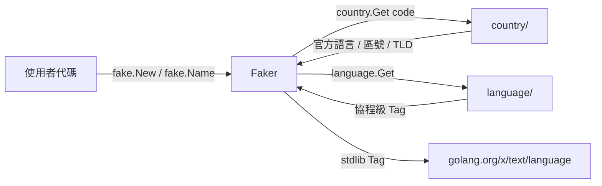

# fake

`fake` 提供**按國家維度的假數據生成**：姓名、身分證號、電話、地址、電郵、UUID、Lorem 文字、隨機時間數值等。強耦合 [`country`](../system/) 與 [`language`](../system/)，與 [`randx`](./randx) 形成「底層隨機 vs 業務假數據」的清晰分工。

## 適合什麼場景

- **單元測試 / 整合測試 fixture**：快速造出合法的姓名 / 身分證 / 電話，省掉手寫常數。
- **Demo / 範例數據**：UI 預覽、文件示例、前端 mock。
- **壓測數據生成**：seedable 可重現，方便回放。
- **本地開發資料庫填充**：249 國數據骨架，按需擴展國家。

## 與 randx 的區別

| 維度 | randx | fake |
| --- | --- | --- |
| 抽象層級 | 底層隨機源（int / float / bool / 位元組） | 業務實體（人名 / 地址 / 證件號） |
| 國家/語言感知 | 否 | 是（按 `country.Code` 分發，復用 `language` 協程級語言） |
| 重現性 | 行程級全域 | 實例級 seed，`WithSeed(42)` 可完全重現 |
| 典型調用方 | 數據處理 / 演算法 / 抽樣 | 測試 / Demo / Mock |

需要原子隨機走 randx；需要「造個像樣的中國使用者」走 fake。

## 核心特性

- **249 國骨架**：每個 ISO 3166-1 國家都有數據檔案佔位；CN / US / JP 已填齊真數據，其他國家走 fallback chain → 官方語言池 → en 兜底。
- **locale 感知**：基於 `country.OfficialLanguages` 自動選語種，無需手動傳 lang。
- **可重現**：`fake.WithSeed(int64)` 內部走 `math/rand/v2` PCG，同 seed 序列完全一致。
- **雙形態 API**：顯式實例 `fake.New(country.China)` 或全域 `fake.Name()`（按 goroutine-local 語言推斷國家）。
- **零分配熱路徑**：`Name()` ≤ 200 ns/op、UUIDv4 ≤ 100 ns/op。

## 快速上手

```go
import (
    "fmt"
    "github.com/lazygophers/utils/country"
    "github.com/lazygophers/utils/fake"
)

f := fake.New(country.China)
fmt.Println(f.Name())     // 張偉
fmt.Println(f.Phone())    // +86 138-xxxx-xxxx
fmt.Println(f.IdCard())   // 18 位身分證 + 校驗碼合法
fmt.Println(f.Email())    // alice.smith@gmail.com
fmt.Println(f.FullAddress())
```

## 全域函數 vs 實例

```go
// 全域：按 language.Get() 推斷當前國家
fake.Name()                              // 預設 en → 英文姓名
language.Set(language.Chinese)
fake.Name()                              // → 中文姓名

// 一次性切國家（鏈式）
fake.WithCountry(country.Japan).Name()   // 日文姓名

// 顯式實例（推薦：測試可控）
f := fake.New(country.Japan)
f.Name()
```

全域函數底層走 `sync.Map` 池快取每國預設 Faker，避免重複建實例。

## 可重現性（WithSeed）

```go
a := fake.New(country.China, fake.WithSeed(42))
b := fake.New(country.China, fake.WithSeed(42))
// 同 seed 下，a 與 b 調用任意 API 輸出序列完全一致
a.Name() == b.Name()   // true
a.IdCard() == b.IdCard() // true
```

帶 seed 實例自帶 Mutex 保證並發安全；預設全域實例走 `math/rand/v2` 全域源（已執行緒安全）。

## API 速查

| 分組 | 函數 |
| --- | --- |
| 姓名身分 | `Name` / `FirstName` / `LastName` / `Username` / `Gender` |
| 證件生日 | `IdCard` / `PassportNo` / `Birthday` |
| 聯絡方式 | `Email` / `Phone` / `Tel` / `CallingCode` |
| 地理地址 | `Province` / `City` / `District` / `Street` / `ZipCode` / `Latitude` / `Longitude` / `FullAddress` |
| 網路識別符 | `UUIDv4` / `UUIDv7` / `IPv4` / `IPv6` / `Mac` / `Md5Hex` / `Sha1Hex` / `Sha256Hex` / `Domain` / `UserAgent` / `Url` |
| 文字 | `Word` / `Sentence` / `Paragraph` / `ChineseWord` / `ChineseSentence` / `ChineseParagraph` |
| 時間數值 | `Date` / `Time` / `IntRange` / `Int64Range` / `Float64Range` / `Bool` / `Pick[T]` / `Sample[T]` / `Shuffle[T]` |
| 顏色檔案 | `HexColor` / `RgbColor` / `HslColor` / `FileName` / `FileExt` / `MimeType` |

## 與 country / language 的整合關係



- `country` 提供靜態元數據（官方語言、電話區號、TLD），fake 不重複定義。
- `language` 提供 goroutine-local Tag，全域函數據此推斷預設國家（zh→CN、en→US、ja→JP）。
- 公共 API 暴露 `language.Tag`（stdlib），不暴露 `utils/language` 內部類型。

## 國家覆蓋

| 國家 | 狀態 | 說明 |
| --- | --- | --- |
| CN（中國） | 真數據 | 百家姓 + 男女名各 200+、34 省 + 主要城市 300+、身分證 GB 11643 校驗 |
| US（美國） | 真數據 | first/last 各 500+、50 州首府 + 主要城市、SSN `xxx-xx-xxxx` |
| JP（日本） | 真數據（lang_ja 或 lang_all build） | 漢字 + ひらがな 姓名、47 都道府縣、My Number |
| 其他 246 國 | 骨架佔位 | 電話區號 / TLD 來自 country 包；姓名/地名 fallback 到官方語言池或 en 兜底 |

新國家可透過 PR 增量補全：`fake/data/<code>.go` 數據骨架 + `fake/data/<code>_<lang>.go` 語種數據，build tag 規則與 country/currency 對齊。

## 注意事項

- **不是 crypto-safe 隨機源**。安全敏感場景（token / 密鑰 / nonce）請用 `crypto/rand` 或 [`cryptox`](../network/cryptox)。
- `IdCard` / `Ssn` / `My Number` 只滿足**格式與校驗位合規**，不對應任何真實自然人；勿用於身分驗證。
- 246 國骨架數據待社群逐步補全；當前 fallback 不保證文化貼合。
- 預設全域實例共享 `math/rand/v2` 全域源；若需嚴格可重現請用 `New(country, WithSeed(...))`。

## 相關文件

- [randx](./randx) — 底層隨機源
- [defaults](./defaults) — 結構體預設值
- [country 模組](../system/) — 國家元數據
