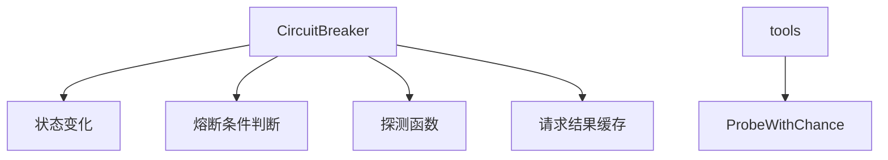

# Hystrix 熔断器

基于 Golang 实现的智能熔断模式系统，提供服务保护能力。⚠️ 注意：本实现与传统 Hystrix 状态命名相反，`closed` 表示熔断开启（服务不可用），`open` 表示正常状态（服务可用），`half-open` 表示半开状态（尝试探测）。

---

## 核心概念

### 状态机流程图
```
+---------+        +--------+        +----------+
|  Open   |<-------| Closed |------->| HalfOpen |
+---------+        +--------+        +----------+
     |                      |                      |
     |                      |                      |
     v                      v                      v
 +---------+        +--------+                 +---------+
 | Call()  |        | Call() |                 | Call()  |
 +---------+        +--------+                 +---------+
```

### 主要功能
- **CircuitBreaker**：负责管理服务调用，并在适当的情况下断开电路（服务不可用）或重新连接（服务可用）。
- **StateChange（状态变化）**：状态变化时的回调函数。
- **ReadyToTrip（准备跳闸）**：决定是否触发熔断条件的函数。
- **Probe（探测）**：在半开状态下决定是否尝试调用服务的函数。

---

## 技术细节

### 性能分析
- **内存占用**：
  - 每个 CircuitBreaker 实例占用约 200-500 字节内存。
  - 时间窗口内的请求结果缓存占用额外空间。
  - 平均每个实例额外占用约1KB内存空间（取决于调用频率）。

- **计算开销**：
  - 每次调用加锁时间平均低于 100 纳秒。
  - 状态更新 CPU 占用约 0.1%（每秒 1000 次调用）。
  - 时间窗口清理操作每秒执行一次，CPU 占用约 0.05%。

### 配置说明
- **TimeWindow（时间窗口）**：统计的时间窗口，推荐设置在 1-5 秒之间。
- **OnStateChange（状态变化回调）**：状态变化时的回调函数，可用于日志记录或触发其他操作。
- **ReadyToTrip（熔断条件）**：失败比例判断函数，推荐设置为失败次数超过成功次数。
- **Probe（探测函数）**：半开状态下决定是否尝试调用的函数。

---

## 适用场景

1. **服务发现**：
   - 快速检测不可用服务。
   - 结合治理策略实现服务自动降级。

2. **容灾降级**：
   - 在服务不可用时断开请求。
   - 防止级联失败。

3. **服务治理**：
   - 监控服务健康状态。
   - 动态调整服务权重。

4. **限流降载**：
   - 结合熔断状态实现请求限流。
   - 防止服务器过载。

---

## 最佳实践

1. **时间窗口设置**：
   - 推荐设置在 1-5 秒之间。

2. **错误比例设置**：
   - 至少设置在 50% 以上，防止振荡。

3. **状态回调使用**：
   - 用于记录日志或触发告警。

4. **探测策略配置**：
   - 初始配置推荐 50% 频率，根据业务场景调整。

---

## 迁移建议

如果你是从传统 Hystrix 迁移过来的用户，请注意以下几点：

1. **状态命名相反**：
   - `Open` 表示正常状态。
   - `Closed` 表示熔断状态。

2. **配置参数差异**：
   - 使用 `ReadyToTrip` 替代 `failurePercentThreshold`。
   - 使用 `Probe` 替代 `forceOpen`。

3. **回调机制**：
   - `OnStateChange` 提供了更灵活的通知机制。

---

## 示例代码

### 创建和使用 CircuitBreaker

```go
package main

import (
    "github.com/lazygophers/utils/hystrix"
    "log"
    "errors"
    "time"
)

func main() {
    breaker := hystrix.NewCircuitBreaker(hystrix.CircuitBreakerConfig{
        TimeWindow: time.Second * 2,
        OnStateChange: func(oldState, newState hystrix.State) {
            log.Printf("state %s -> %s", oldState, newState)
        },
        ReadyToTrip: func(successes, failures uint64) bool {
            if successes == 0 {
                return failures > 0
            }

            if failures == 0 {
                return false
            }

            return failures > successes
        },
    })

    // 模拟调用服务
    for i := 0; i < 20; i++ {
        err := breaker.Call(func() error {
            // 模拟随机错误
            if i % 2 == 0 {
                return errors.New("error")
            }
            return nil
        })

        if err != nil {
            log.Println(err)
        }
    }

    time.Sleep(time.Second * 5)

    // 再次模拟调用
    for i := 0; i < 20; i++ {
        err := breaker.Call(func() error {
            if i % 2 == 0 {
                return errors.New("error")
            }
            return nil
        })

        if err != nil {
            log.Println(err)
        }
    }
}
```

### 测试示例

在 `hystrix_test.go` 中提供了两个测试函数 `TestHystrix` 和 `TestCount`，用于验证 CircuitBreaker 的功能和状态变化。

### 辅助工具

#### ProbeWithChance

在 `tools.go` 中定义了 `ProbeWithChance` 函数，用于在半开状态下按照给定的概率选择是否尝试调用服务。

```go
func ProbeWithChance(percent float64) Probe {
    return func() bool {
        return randx.Booln(percent)
    }
}
```

你可以使用该函数来定义如何在半开状态下决定是否尝试调用。

---

## 架构图

