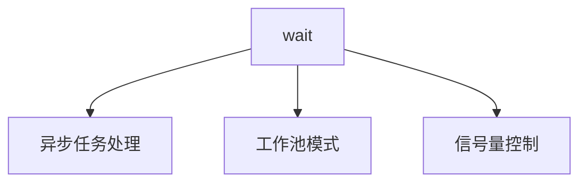

# wait  
并发控制工具集  

## 功能概览
提供三类并发控制模式：


### 功能对比
| 功能模块       | 适用场景               | 并发控制方式     |
|----------------|------------------------|------------------|
| 异步任务处理   | 异步流水线任务         | 协程池+任务队列  |
| 工作池模式     | 固定数量任务并发       | 固定worker池     |
| 信号量控制     | 资源访问控制           | 信号量           |

## 核心模块

### 异步任务处理（Async）
基于协程池的异步任务处理能力：
- 支持普通任务和唯一性任务（相同任务只执行一次）
- 自动管理WaitGroup和通道
- 内置异常恢复机制

#### 使用示例
```go
// 普通任务处理
Async(10, func(c chan int) {
    for i := 0; i < 100; i++ {
        c <- i
    }
}, func(i int) {
    // 任务处理逻辑
})

// 唯一性任务处理（需实现UniqueKey接口）
AsyncUnique(10, func(c chan MyTask) {
    // 推送任务
}, func(task MyTask) {
    // 任务处理逻辑
})
```

#### 约束
1. 任务推送完成后必须关闭通道
2. 唯一性任务的Key需保证全局唯一

### 工作池模式（Worker）
创建固定数量的工作协程处理任务：
- 通过通道传递任务函数
- 自动等待所有任务完成
- 内置panic恢复机制

#### 使用示例
```go
// 创建包含10个worker的池
worker := NewWorker(10)

// 提交任务
for i := 0; i < 100; i++ {
    worker.Add(func() {
        // 任务执行逻辑
    })
}

// 等待所有任务完成
worker.Wait()
```

#### 约束
1. 不要在工作池停止后添加新任务
2. 任务函数应自行处理panic

### 信号量控制（Sync Pool）
基于通道的信号量实现：
- 控制资源并发访问数量
- 支持同步执行模式
- 提供深度监控接口

#### 使用示例
```go
// 初始化信号量控制（最大并发数=10）
Ready("db_pool", 10)

// 同步执行任务（自动管理锁）
err := Sync("db_pool", func() error {
    // 受保护的资源访问逻辑
    return nil
})

// 直接使用锁
pool := GetPool("db_pool")
pool.Lock()
defer pool.Unlock()
// 临界区操作
```

#### 约束
1. 使用前必须调用Ready初始化
2. Sync方法会返回业务逻辑错误

## 使用约束
1. 所有并发操作需注意资源竞争
2. 建议配合context实现超时控制