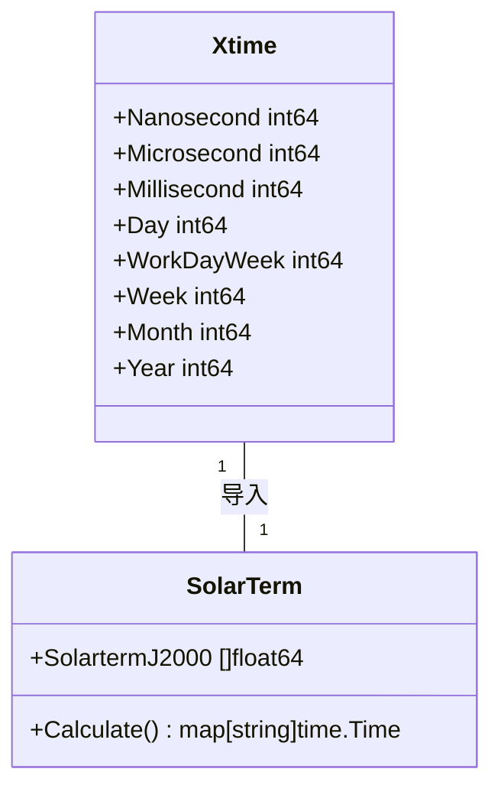
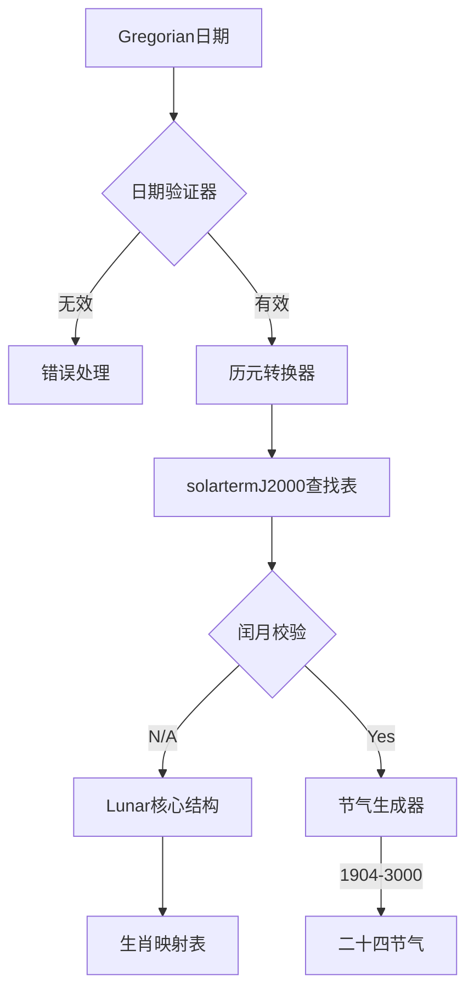

# xtime  
时间处理扩展模块  
支持特性：  
- 955/996/007格式解析  
- 二十四节气计算  
- 高精度时间戳操作  
- 时区转换优化
### 农历API接口说明  
  
#### Lunar类型  
```go  
type Lunar struct {  
	time.Time  
  
	year, month, day int64  
	monthIsLeap      bool  
}  
```  
**功能**：封装农历时间计算核心逻辑  
  
#### 核心方法  
- `LeapMonth() int64`  
  获取当前农历年的闰月（0表示无闰月，5表示闰五月）  
  > 依赖`leapMonth(int64)`实现（代码在`lunar.go`第12-15行）  
  
- `IsLeap() bool`  
  检查是否是闰年  
  
- `IsLeapMonth() bool`  
  检查是否为当前农历月的闰月标识  
  
- `Animal() string`  
  返回年份对应的生肖（如龙、兔、虎等）  
  > 使用`OrderMod()`计算（代码在`lunar.go`第33行）
### 常量定义规范  
  
**xtime/xtime.go** 中定义了时间单位常量：  
```go
const (
// 倍数关系常量（时间）
Nanosecond = time.Nanosecond 
Microsecond = time.Microsecond
Millisecond = time.Millisecond
// ... (更多标准时间常量)
)
```

**工作周期计算常量**  
```go
const (
WorkDayMonth = Day*21 + HalfDay  // 非闰月每月21个工作日（3月16:00）
ResetMonth   = Day*8 + HalfDay   // 月份重置基准
Month        = Day * 30           // 标准月定义
// ... (其他周期定义)
)
```

#### 节气计算模块  
**源文件**: [`xtime/solarterm.go`](xtime/solarterm.go:1)  
**核心逻辑**：  
1. 支持年份区间：1904-3000年  
2. 使用`math`包处理节气计算  
3. 核心数组`solartermJ2000`存储24节气天文年表数据  

#### Mermaid时间模块关系图  

## 🌕 农历API交互模型  
  


**关联组件验证**  
连续调用`LeapMonth()`后必须验证是否满足：  
- 工作周期 ∈ [WorkDayWeek, Week, ResetMonth]  
- 日期跨度 ≤ [MonthlyPeriodValidator](memory-bank/decisionLog.md:45) 定义